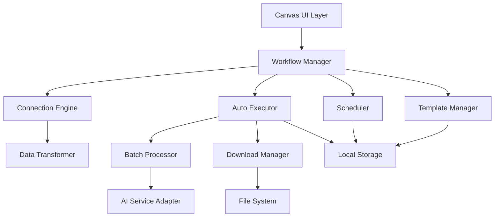

# Design Document: Automation Enhancement

## Overview

This design document outlines the implementation of automation enhancement features for the Creative Canvas application. The system will extend existing functionality with minimal changes to provide workflow automation capabilities including module connection data flow, template management, scheduled execution, and batch processing.

The design follows the principle of minimal disruption to existing code while maximizing automation capabilities. All new features will integrate seamlessly with the current canvas-based module system (text, image, video blocks) and existing UI components.

## Architecture

### High-Level Architecture



### Core Components Integration

The automation system integrates with existing components:

- **Canvas Component**: Enhanced to support data flow visualization
- **Block Component**: Extended prompt input box with variable support
- **Batch Processor**: Leveraged for automated execution
- **AI Service Adapter**: Used for content generation
- **Local Storage**: Extended for template and state persistence

## Components and Interfaces

### 1. Connection Engine

Enhances existing connection system with data flow capabilities.

```typescript
interface ConnectionEngine {
  // Extend existing Connection type
  enhanceConnection(connection: Connection): EnhancedConnection;
  
  // Data flow management
  propagateData(fromBlockId: string, data: any): void;
  getUpstreamData(blockId: string): BlockData[];
  validateDataFlow(connections: Connection[]): ValidationResult;
}

interface EnhancedConnection extends Connection {
  dataFlow: {
    enabled: boolean;
    lastUpdate: number;
    dataType: 'text' | 'image' | 'video';
  };
}

interface BlockData {
  blockId: string;
  blockNumber: string;
  content: string;
  type: BlockType;
  timestamp: number;
}
```

### 2. Variable System

Extends existing prompt input functionality with variable support.

```typescript
interface VariableSystem {
  parseVariables(prompt: string): VariableReference[];
  resolveVariables(prompt: string, context: BlockData[]): string;
  validateVariables(prompt: string, availableBlocks: string[]): ValidationError[];
  getAvailableVariables(blockId: string, connections: Connection[]): string[];
}

interface VariableReference {
  variable: string;        // e.g., "[A01]"
  blockNumber: string;     // e.g., "A01"
  position: [number, number]; // start, end positions in text
}

// Variable syntax: [BlockNumber] - references block output
// Example: "Generate image based on [A01] description with [B02] style"
```

### 3. Template Manager

Manages workflow templates with complete canvas state persistence.

```typescript
interface TemplateManager {
  saveTemplate(canvas: CanvasState, name: string): Promise<Template>;
  loadTemplate(templateId: string): Promise<CanvasState>;
  listTemplates(): Promise<Template[]>;
  deleteTemplate(templateId: string): Promise<void>;
  exportTemplate(templateId: string): Promise<string>;
  importTemplate(templateData: string): Promise<Template>;
}

interface Template {
  id: string;
  name: string;
  description?: string;
  createdAt: Date;
  updatedAt: Date;
  canvasState: CanvasState;
  metadata: {
    blockCount: number;
    connectionCount: number;
    hasFileInput: boolean;
  };
}

interface CanvasState {
  blocks: Block[];
  connections: EnhancedConnection[];
  settings: {
    zoom: number;
    pan: { x: number; y: number };
  };
  attachments?: AttachmentData[];
}
```

### 4. Auto Executor

Core automation engine that executes workflows based on connection logic.

```typescript
interface AutoExecutor {
  executeWorkflow(canvas: CanvasState, options: ExecutionOptions): Promise<ExecutionResult>;
  pauseExecution(executionId: string): Promise<void>;
  resumeExecution(executionId: string): Promise<void>;
  cancelExecution(executionId: string): Promise<void>;
  getExecutionStatus(executionId: string): ExecutionStatus;
}

interface ExecutionOptions {
  batchInput?: BatchInputSource;
  downloadPath?: string;
  maxConcurrency?: number;
  retryPolicy?: RetryPolicy;
  notificationSettings?: NotificationSettings;
}

interface ExecutionResult {
  executionId: string;
  status: 'completed' | 'failed' | 'cancelled';
  results: BlockResult[];
  statistics: ExecutionStatistics;
  errors?: ExecutionError[];
}

interface ExecutionStatus {
  executionId: string;
  status: 'running' | 'paused' | 'completed' | 'failed' | 'cancelled';
  progress: {
    total: number;
    completed: number;
    failed: number;
    current?: string; // current block being processed
  };
  startTime: Date;
  estimatedCompletion?: Date;
}
```

### 5. Batch Input System

Handles file-based batch processing with support for folders and file parsing.

```typescript
interface BatchInputSystem {
  readFolder(folderPath: string): Promise<FileInput[]>;
  parseTextFile(file: File, delimiter?: string): Promise<string[]>;
  validateFileFormat(file: File): boolean;
  createBatchItems(inputs: FileInput[]): BatchItem[];
}

interface FileInput {
  name: string;
  path: string;
  type: 'text' | 'image';
  content: string | ArrayBuffer;
  size: number;
}

interface BatchItem {
  id: string;
  name: string;
  input: FileInput;
  status: 'pending' | 'processing' | 'completed' | 'failed';
  result?: any;
  error?: string;
}
```

### 6. Scheduler

Manages timed execution of templates with persistence across system restarts.

```typescript
interface Scheduler {
  scheduleExecution(schedule: ScheduleConfig): Promise<string>;
  cancelSchedule(scheduleId: string): Promise<void>;
  listSchedules(): Promise<ScheduleInfo[]>;
  updateSchedule(scheduleId: string, updates: Partial<ScheduleConfig>): Promise<void>;
}

interface ScheduleConfig {
  templateId: string;
  cronExpression: string;
  executionOptions: ExecutionOptions;
  enabled: boolean;
  maxRuns?: number;
  endDate?: Date;
}

interface ScheduleInfo extends ScheduleConfig {
  id: string;
  createdAt: Date;
  lastRun?: Date;
  nextRun?: Date;
  runCount: number;
  lastResult?: ExecutionResult;
}
```

## Data Models

### Enhanced Block Model

Extends existing Block interface with automation-specific properties:

```typescript
interface AutomationBlock extends Block {
  // Existing Block properties remain unchanged
  automation?: {
    variables: VariableReference[];
    upstreamBlocks: string[];
    lastExecution?: {
      timestamp: Date;
      duration: number;
      success: boolean;
    };
  };
}
```

### Execution History

```typescript
interface ExecutionHistory {
  id: string;
  templateId: string;
  templateName: string;
  executionType: 'manual' | 'scheduled' | 'batch';
  startTime: Date;
  endTime?: Date;
  status: ExecutionStatus['status'];
  results: BlockResult[];
  statistics: ExecutionStatistics;
  configuration: ExecutionOptions;
}

interface ExecutionStatistics {
  totalBlocks: number;
  successfulBlocks: number;
  failedBlocks: number;
  totalDuration: number;
  averageBlockDuration: number;
  apiCallsUsed: number;
  filesGenerated: number;
  filesDownloaded: number;
}
```

## Correctness Properties

*A property is a characteristic or behavior that should hold true across all valid executions of a system-essentially, a formal statement about what the system should do. Properties serve as the bridge between human-readable specifications and machine-verifiable correctness guarantees.*

### Property 1: Connection Data Flow Consistency
*For any* connected modules A and B, when module A's output is updated, module B should receive the updated data as input within the next execution cycle.
**Validates: Requirements 1.1, 1.4**

### Property 2: Variable Resolution Correctness
*For any* prompt containing valid variable references, the resolved prompt should contain the actual content from referenced blocks, maintaining the original prompt structure.
**Validates: Requirements 2.1, 2.3**

### Property 3: Template State Preservation
*For any* canvas state saved as a template, loading the template should restore an equivalent canvas state with identical blocks, connections, and configurations.
**Validates: Requirements 3.1, 3.5**

### Property 4: Execution Order Consistency
*For any* workflow with connected modules, automatic execution should process modules in topological order respecting all connection dependencies.
**Validates: Requirements 4.1, 4.3**

### Property 5: Batch Processing File Handling
*For any* valid input folder containing supported file types, the batch processor should successfully read and process each file according to its type (text or image).
**Validates: Requirements 5.1, 5.2, 5.3**

### Property 6: Schedule Execution Reliability
*For any* scheduled template execution, the system should execute the template at the specified time with the correct configuration, regardless of system restarts.
**Validates: Requirements 6.2, 6.3**

### Property 7: Download Organization Consistency
*For any* completed workflow execution, all generated files should be downloaded to the specified directory with consistent naming and organization structure.
**Validates: Requirements 7.1, 7.2**

### Property 8: Execution History Completeness
*For any* completed workflow execution, the execution history should contain complete information about execution time, results, and statistics.
**Validates: Requirements 8.1, 8.3**

### Property 9: State Recovery Reliability
*For any* interrupted automation task, the system should be able to resume from the last saved checkpoint without data loss or duplicate processing.
**Validates: Requirements 9.2, 9.4**

### Property 10: Error Handling Isolation
*For any* batch processing operation, failure of individual items should not prevent processing of other items, and all errors should be properly logged.
**Validates: Requirements 10.1, 10.4**

### Property 11: Resource Management Compliance
*For any* automation execution, the system should respect configured resource limits including concurrency, API rate limits, and memory usage.
**Validates: Requirements 11.1, 11.2**

### Property 12: Data Security Preservation
*For any* automation process involving sensitive data, all temporary files should be cleaned up after processing, and sensitive information should be encrypted in storage.
**Validates: Requirements 12.1, 12.2, 12.3**

## Error Handling

### Error Categories

1. **Connection Errors**: Invalid connections, circular dependencies
2. **Variable Errors**: Undefined variables, type mismatches
3. **Template Errors**: Corrupted templates, missing dependencies
4. **Execution Errors**: API failures, timeout errors, resource exhaustion
5. **File Errors**: Invalid file formats, access permissions, storage issues
6. **Schedule Errors**: Invalid cron expressions, missed executions

### Error Recovery Strategies

```typescript
interface ErrorRecoveryStrategy {
  retryPolicy: {
    maxRetries: number;
    backoffStrategy: 'linear' | 'exponential';
    retryableErrors: string[];
  };
  fallbackActions: {
    skipFailedItems: boolean;
    useDefaultValues: boolean;
    notifyUser: boolean;
  };
  persistenceStrategy: {
    saveProgressOnError: boolean;
    enableRecoveryMode: boolean;
  };
}
```

### Error Logging

All errors will be logged with structured information:

```typescript
interface ErrorLog {
  timestamp: Date;
  executionId: string;
  blockId?: string;
  errorType: string;
  errorMessage: string;
  stackTrace?: string;
  context: {
    templateId?: string;
    batchItemId?: string;
    retryCount: number;
  };
  userImpact: 'low' | 'medium' | 'high';
  recoveryAction?: string;
}
```

## Testing Strategy

### Unit Testing
- **Connection Engine**: Test data flow propagation and validation
- **Variable System**: Test variable parsing and resolution
- **Template Manager**: Test save/load operations and data integrity
- **Auto Executor**: Test execution logic and error handling
- **Batch Input System**: Test file reading and parsing
- **Scheduler**: Test schedule management and execution timing

### Property-Based Testing
Each correctness property will be implemented as a property-based test with minimum 100 iterations:

- **Property 1**: Generate random module connections and verify data flow
- **Property 2**: Generate random prompts with variables and verify resolution
- **Property 3**: Generate random canvas states and verify template round-trip
- **Property 4**: Generate random workflow graphs and verify execution order
- **Property 5**: Generate random file sets and verify batch processing
- **Property 6**: Generate random schedules and verify execution timing
- **Property 7**: Generate random executions and verify download organization
- **Property 8**: Generate random executions and verify history completeness
- **Property 9**: Generate random interruption scenarios and verify recovery
- **Property 10**: Generate random error scenarios and verify isolation
- **Property 11**: Generate random resource scenarios and verify compliance
- **Property 12**: Generate random data scenarios and verify security

### Integration Testing
- **End-to-End Workflow**: Test complete automation workflows
- **UI Integration**: Test new UI components with existing interface
- **Storage Integration**: Test persistence across browser sessions
- **API Integration**: Test with actual AI service providers

### Performance Testing
- **Large Batch Processing**: Test with 100+ files
- **Complex Workflows**: Test with 20+ connected modules
- **Long-Running Tasks**: Test multi-hour executions
- **Memory Usage**: Monitor memory consumption during extended operations

The testing strategy ensures reliability and correctness of the automation system while maintaining compatibility with existing functionality.