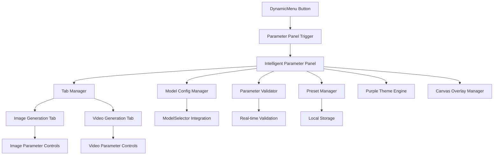

# Design Document: Intelligent Parameter Panel System

## Overview

The Intelligent Parameter Panel System is a unified modal interface that provides comprehensive parameter configuration for image and video generation models. The system addresses the current limitation of small 12x12px DynamicMenu buttons by offering a large, floating modal panel that can temporarily occupy canvas space while maintaining a consistent purple theme and providing model-aware parameter validation.

The design leverages existing components (ModelSelector, VideoAdvancedEditModal structure) and integrates seamlessly with the current architecture while providing an enhanced user experience for complex parameter configuration.

## Architecture

### System Components



### Integration Points

The system integrates with existing components through well-defined interfaces:

- **ModelSelector**: Provides model selection and capability detection
- **VideoAdvancedEditModal**: Reuses modal structure and layout patterns
- **AIServiceAdapter**: Maintains compatibility for parameter passing
- **DynamicMenu**: Serves as the trigger point for the parameter panel

### Data Flow

1. User clicks DynamicMenu parameter button
2. Parameter Panel opens with model-specific parameters
3. User configures parameters with real-time validation
4. Parameters are saved as presets (optional)
5. Parameters are passed to generation service via existing adapters

## Components and Interfaces

### Core Components

#### ParameterPanel Component

```typescript
interface ParameterPanelProps {
  isOpen: boolean;
  onClose: () => void;
  selectedModel: string;
  generationType: 'image' | 'video';
  onParametersChange: (parameters: GenerationParameters) => void;
  initialParameters?: GenerationParameters;
  theme?: 'light' | 'dark';
  lang?: 'zh' | 'en';
}
```

#### TabManager Component

```typescript
interface TabManagerProps {
  activeTab: 'image' | 'video';
  onTabChange: (tab: 'image' | 'video') => void;
  availableTabs: ('image' | 'video')[];
  theme: 'light' | 'dark';
}
```

#### ParameterControls Component

```typescript
interface ParameterControlsProps {
  generationType: 'image' | 'video';
  modelId: string;
  parameters: GenerationParameters;
  onParameterChange: (key: string, value: any) => void;
  validationErrors: ValidationError[];
  theme: 'light' | 'dark';
}
```

#### PresetManager Component

```typescript
interface PresetManagerProps {
  generationType: 'image' | 'video';
  currentParameters: GenerationParameters;
  onPresetLoad: (preset: ParameterPreset) => void;
  onPresetSave: (name: string, parameters: GenerationParameters) => void;
  theme: 'light' | 'dark';
}
```

### Service Interfaces

#### ModelConfigService

```typescript
interface ModelConfigService {
  getModelParameters(modelId: string, generationType: 'image' | 'video'): ModelParameter[];
  getModelRestrictions(modelId: string): ModelRestrictions;
  validateParameter(modelId: string, parameterKey: string, value: any): ValidationResult;
}
```

#### ParameterValidationService

```typescript
interface ParameterValidationService {
  validateParameters(modelId: string, parameters: GenerationParameters): ValidationResult[];
  validateFileSize(file: File, maxSize: number): boolean;
  validateAspectRatio(ratio: string, supportedRatios: string[]): boolean;
  validateImageFormat(file: File, supportedFormats: string[]): boolean;
}
```

#### PresetStorageService

```typescript
interface PresetStorageService {
  savePreset(preset: ParameterPreset): Promise<void>;
  loadPresets(generationType: 'image' | 'video'): Promise<ParameterPreset[]>;
  deletePreset(presetId: string): Promise<void>;
  updatePreset(presetId: string, preset: ParameterPreset): Promise<void>;
}
```

## Data Models

### Core Data Structures

#### GenerationParameters

```typescript
interface GenerationParameters {
  // Common parameters
  prompt: string;
  negativePrompt?: string;
  seed?: number;
  
  // Image-specific parameters
  aspectRatio?: '16:9' | '9:16' | '1:1' | '4:3' | '4:5' | '5:4' | '2:3' | '3:2' | '21:9';
  imageSize?: '1K' | '2K' | '4K';
  guidanceScale?: number;
  steps?: number;
  referenceImage?: File | string;
  
  // Video-specific parameters
  duration?: '10' | '15' | '25';
  fps?: number;
  motionStrength?: number;
  cameraMovement?: 'static' | 'pan' | 'zoom' | 'rotate';
  referenceVideo?: File | string;
  
  // Advanced parameters
  customParameters?: Record<string, any>;
}
```

#### ModelParameter

```typescript
interface ModelParameter {
  key: string;
  label: string;
  type: 'text' | 'number' | 'select' | 'boolean' | 'file' | 'range';
  defaultValue: any;
  required: boolean;
  validation: ParameterValidation;
  description?: string;
  category?: string;
  advanced?: boolean;
}
```

#### ModelRestrictions

```typescript
interface ModelRestrictions {
  maxFileSize: number; // in bytes
  supportedFormats: string[];
  supportedAspectRatios: string[];
  maxDuration?: number; // for video, in seconds
  maxResolution?: { width: number; height: number };
  parameterLimits: Record<string, { min?: number; max?: number; options?: string[] }>;
}
```

#### ParameterPreset

```typescript
interface ParameterPreset {
  id: string;
  name: string;
  description?: string;
  generationType: 'image' | 'video';
  modelId?: string; // if null, applies to all models
  parameters: GenerationParameters;
  createdAt: number;
  updatedAt: number;
  isDefault?: boolean;
}
```

#### ValidationResult

```typescript
interface ValidationResult {
  isValid: boolean;
  errors: ValidationError[];
  warnings: ValidationWarning[];
}

interface ValidationError {
  parameterKey: string;
  message: string;
  code: string;
  severity: 'error' | 'warning';
}

interface ValidationWarning {
  parameterKey: string;
  message: string;
  suggestion?: string;
}
```

### State Management

#### ParameterPanelState

```typescript
interface ParameterPanelState {
  isOpen: boolean;
  activeTab: 'image' | 'video';
  selectedModel: string;
  parameters: GenerationParameters;
  validationResults: ValidationResult[];
  presets: ParameterPreset[];
  isLoading: boolean;
  error?: string;
}
```

## Correctness Properties

*A property is a characteristic or behavior that should hold true across all valid executions of a system-essentially, a formal statement about what the system should do. Properties serve as the bridge between human-readable specifications and machine-verifiable correctness guarantees.*

### Property-Based Testing Properties

Based on the prework analysis and property reflection, the following properties validate the system's correctness:

**Property 1: Modal Opening and Positioning**
*For any* DynamicMenu parameter button click, the Parameter_Panel should open as a floating modal above the canvas with dimensions larger than 800x600px
**Validates: Requirements 1.1, 1.2**

**Property 2: State Isolation and Persistence**
*For any* parameter configuration session, opening and closing the modal should preserve all configured parameter values while maintaining the underlying page state unchanged
**Validates: Requirements 1.3, 1.5**

**Property 3: Modal Dismissal Behavior**
*For any* click outside the Parameter_Panel boundaries, the modal should close and return focus to the canvas
**Validates: Requirements 1.4**

**Property 4: Purple Theme Consistency**
*For any* interactive element in the Parameter_Panel, the styling should use violet-500 as the primary color with consistent purple hover states, focus indicators, and validation success states
**Validates: Requirements 2.1, 2.2, 2.3, 2.4, 2.5**

**Property 5: Tab-Specific Parameter Display**
*For any* tab selection (Image Generation or Video Generation), the system should display only the parameter controls specific to that generation type while preserving parameter values in inactive tabs
**Validates: Requirements 3.2, 3.3, 3.4**

**Property 6: Active Tab Visual Indication**
*For any* active tab, the Tabbed_Interface should provide clear visual distinction from inactive tabs
**Validates: Requirements 3.5**

**Property 7: Model-Specific Parameter Loading**
*For any* model selection, the Parameter_Panel should display only the parameters supported by that model and update immediately when the model changes
**Validates: Requirements 4.1, 4.2, 4.5**

**Property 8: Adaptive Interface Complexity**
*For any* model with custom parameters, the Parameter_Panel should display advanced configuration options, while models with limited parameters should show a simplified interface
**Validates: Requirements 4.3, 4.4**

**Property 9: Real-Time Parameter Validation**
*For any* parameter input, the system should validate the value against model restrictions immediately and display appropriate validation feedback
**Validates: Requirements 5.1, 5.2, 5.3, 7.1**

**Property 10: Validation State Display**
*For any* parameter validation result, invalid values should display red borders and error messages, while valid values should show green checkmarks, with all validation states updating in real-time
**Validates: Requirements 7.2, 7.3, 7.4**

**Property 11: Generation Button State Management**
*For any* parameter configuration state, the generation action button should be enabled only when all parameters pass validation
**Validates: Requirements 5.5**

**Property 12: Preset Management Round-Trip**
*For any* parameter configuration, saving as a preset and then loading that preset should restore all parameter values exactly
**Validates: Requirements 6.2, 6.4, 6.5**

**Property 13: Preset Availability Display**
*For any* Parameter_Panel opening, all previously saved presets should be available in the preset dropdown
**Validates: Requirements 6.3**

**Property 14: Component Integration Compatibility**
*For any* interaction with existing components (ModelSelector, AIServiceAdapter), the Parameter_Panel should maintain API compatibility without modifying existing component behavior
**Validates: Requirements 8.1, 8.2, 8.3, 8.4, 8.5**

**Property 15: Responsive Layout Adaptation**
*For any* screen size or window resize, the Parameter_Panel should adapt its layout to maintain usability, utilizing available space effectively on large screens and providing scrollable sections on smaller screens
**Validates: Requirements 9.1, 9.2, 9.3, 9.4, 9.5**

**Property 16: Error Handling and User Feedback**
*For any* error condition (model loading failure, validation failure, preset loading failure), the system should display user-friendly error messages with specific explanations and appropriate recovery options
**Validates: Requirements 10.1, 10.2, 10.3**

**Property 17: Loading State Display**
*For any* processing operation, the Parameter_Panel should show appropriate loading indicators during processing and confirmation feedback upon successful completion
**Validates: Requirements 10.4, 10.5**

**Property 18: Model-Type Conditional Activation**
*For any* model selection, text generation models should not trigger the Parameter_Panel, while image and video generation models should make the Parameter_Panel available
**Validates: Requirements 11.1, 11.2, 11.4, 11.5**

## Error Handling

### Error Categories

The system handles several categories of errors:

1. **Model Loading Errors**: When model parameters fail to load
2. **Validation Errors**: When user input violates model restrictions
3. **Preset Errors**: When preset loading or saving fails
4. **Network Errors**: When API calls fail
5. **File Upload Errors**: When file validation fails

### Error Recovery Strategies

- **Graceful Degradation**: Show simplified interface when advanced parameters fail to load
- **Retry Mechanisms**: Provide retry options for transient failures
- **Fallback Values**: Use default parameters when presets fail to load
- **User Guidance**: Provide clear instructions for resolving validation errors

### Error Message Design

All error messages follow a consistent pattern:
- Clear description of what went wrong
- Specific explanation of the restriction or limit
- Actionable guidance for resolution
- Visual indicators (red borders, warning icons)

## Testing Strategy

### Dual Testing Approach

The system uses both unit testing and property-based testing for comprehensive coverage:

**Unit Tests** focus on:
- Specific parameter validation examples
- Edge cases for file uploads and format validation
- Integration points between components
- Error conditions and recovery scenarios

**Property Tests** focus on:
- Universal properties that hold for all inputs
- Parameter validation across all supported models
- Theme consistency across all interactive elements
- State preservation across all user interactions

### Property-Based Testing Configuration

- **Minimum 100 iterations** per property test to ensure comprehensive coverage
- **Test tagging** format: **Feature: intelligent-parameter-panel, Property {number}: {property_text}**
- **Random input generation** for parameters, file sizes, aspect ratios, and model configurations
- **State-based testing** for modal lifecycle and parameter persistence

### Testing Libraries

The implementation will use:
- **Jest** for unit testing framework
- **React Testing Library** for component testing
- **fast-check** for property-based testing in TypeScript
- **MSW (Mock Service Worker)** for API mocking

### Test Coverage Requirements

- **90%+ code coverage** for all components
- **100% property coverage** for all correctness properties
- **Edge case coverage** for all validation scenarios
- **Integration coverage** for all existing component interactions