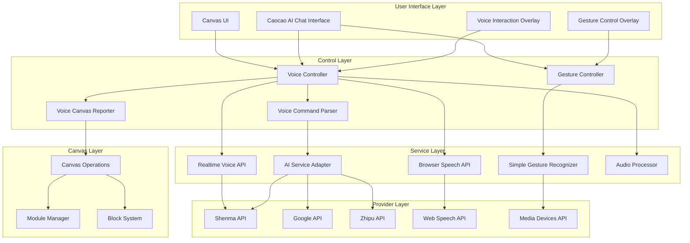

# Design Document: Intelligent Voice Module Control System

## Overview

The Intelligent Voice Module Control System is a sophisticated multimodal interface architecture that enables seamless voice and gesture control of a Canvas-based AI content creation platform. The system implements a dual-mode voice recognition approach with real-time WebSocket communication and browser-based fallback, integrated with advanced gesture recognition, multi-provider AI services, and precise canvas module manipulation capabilities.

The architecture emphasizes reliability through graceful degradation, extensibility through modular design, and user experience through intelligent feedback and error handling. The system supports both Chinese and English languages with natural language processing for complex command interpretation.

## Architecture

### High-Level Architecture



### Component Architecture

The system follows a layered architecture with clear separation of concerns:

1. **User Interface Layer**: Provides visual feedback and control interfaces
2. **Control Layer**: Manages voice and gesture input processing and command interpretation
3. **Service Layer**: Handles communication with external APIs and audio processing
4. **Provider Layer**: Interfaces with specific AI and browser APIs
5. **Canvas Layer**: Manages canvas operations and module manipulation

## Components and Interfaces

### Voice Controller Component

The Voice Controller is the central orchestrator for all voice-related functionality:

**Core Responsibilities:**
- Dual-mode voice recognition management (Realtime API + Browser Speech API)
- Voice command lifecycle management
- Audio processing coordination
- Error handling and fallback logic
- Multi-language support (Chinese/English)

**Key Interfaces:**
```typescript
interface VoiceControllerProps {
  onCommand: (command: VoiceCommand) => void;
  lang?: 'zh' | 'en';
  wakeWord?: string;
  position?: { x: number; y: number };
  theme?: 'light' | 'dark';
  isActive?: boolean;
  apiSettings?: APISettings;
  onMessage?: (role: 'user' | 'assistant', content: string, type?: 'voice' | 'system') => void;
  onStatusChange?: (status: ConnectionStatus, message?: string) => void;
  blocks?: Block[];
  onModuleAction?: (action: string, moduleId?: string, params?: any) => void;
}

interface VoiceCommand {
  command: 'generate_text' | 'generate_image' | 'generate_video' | 'add_to_canvas' | 'unknown';
  text: string;
  content: string;
  params?: {
    aspectRatio?: string;
    style?: string;
    duration?: number;
  };
}
```

### Realtime Voice API Service

Implements WebSocket-based real-time voice communication with the Shenma API:

**Core Features:**
- PCM16 audio format conversion and streaming
- Real-time audio transcription
- AI voice synthesis and playback
- Session management with automatic reconnection
- Comprehensive event handling for all Realtime API events

**WebSocket Event Handling:**
- Session events (created, updated)
- Conversation events (item created, transcription completed)
- Audio buffer events (speech started/stopped, committed)
- Response events (created, done, content streaming)
- Error handling and rate limit management

### Voice Canvas Reporter Service

Provides intelligent canvas state reporting and module command parsing:

**Core Capabilities:**
- Comprehensive canvas state analysis and reporting
- Natural language module command parsing
- Multi-language support for command interpretation
- Module operation validation and execution
- Detailed feedback generation

**Command Parsing Patterns:**
- Module selection: "选择A01", "select A01"
- Content generation: "给A01生成内容", "generate content for A01"
- Prompt modification: "给B02增加奔跑的马", "add running horse to B02"
- Module operations: regenerate, delete, move, connect, copy

### Gesture Recognition System

Implements camera-based gesture detection with keyboard shortcut simulation:

**Gesture Types Supported:**
- `zoom_in` / `zoom_out`: Canvas scaling operations
- `move_up` / `move_down` / `move_left` / `move_right`: Canvas navigation
- `reset_view`: Canvas view reset
- `auto_layout`: Automatic module layout
- `select_all`: Multi-module selection
- `clear_canvas`: Canvas clearing operation

**Implementation Features:**
- Real-time camera feed processing
- Visual feedback overlay
- Audio feedback for gesture recognition
- Keyboard shortcut simulation for testing
- Confidence scoring and gesture validation

### AI Service Adapter

Provides unified interface for multiple AI providers with intelligent routing:

**Supported Providers:**
- Google Gemini API
- Zhipu AI API  
- Shenma API

**Core Features:**
- Provider-specific request/response handling
- Automatic failover and retry logic
- Request routing based on content type and provider capabilities
- Conversation history management
- Rate limiting and quota management

## Data Models

### Block/Module Data Model

```typescript
interface Block {
  id: string;
  number: string; // A01, B02, V01, etc.
  type: 'text' | 'image' | 'video';
  status: 'idle' | 'processing' | 'error';
  content: string;
  x: number;
  y: number;
  width: number;
  height: number;
  connections?: string[]; // Connected block IDs
  metadata?: {
    prompt?: string;
    provider?: string;
    generatedAt?: Date;
    modifiedAt?: Date;
  };
}
```

### Voice Module Command Model

```typescript
interface VoiceModuleCommand {
  action: 'select' | 'delete' | 'generate' | 'regenerate' | 'modify_prompt' | 'move' | 'copy' | 'edit' | 'connect';
  targetModule?: string; // A01, B02, V01
  targetModules?: string[]; // For batch operations
  content?: string; // Generation content or edit content
  promptModification?: string; // Prompt modification content
  direction?: 'up' | 'down' | 'left' | 'right'; // Movement direction
  connectTo?: string; // Connection target module
}
```

### Audio Processing Model

```typescript
interface AudioProcessingConfig {
  sampleRate: number; // 16000 Hz for PCM16
  channelCount: number; // 1 for mono
  echoCancellation: boolean;
  noiseSuppression: boolean;
  autoGainControl: boolean;
  bufferSize: number; // Audio buffer size in ms
}

interface AudioStreamEvent {
  type: 'audio_start' | 'audio_data' | 'audio_end' | 'transcription' | 'synthesis';
  data?: ArrayBuffer | string;
  timestamp: number;
  confidence?: number;
}
```

### Gesture Recognition Model

```typescript
interface GestureResult {
  gesture: SimpleGestureType;
  confidence: number;
  timestamp: number;
  boundingBox?: {
    x: number;
    y: number;
    width: number;
    height: number;
  };
}

type SimpleGestureType = 
  | 'zoom_in' | 'zoom_out' 
  | 'move_up' | 'move_down' | 'move_left' | 'move_right'
  | 'reset_view' | 'clear_canvas' | 'auto_layout' | 'select_all'
  | 'idle';
```

## Correctness Properties

*A property is a characteristic or behavior that should hold true across all valid executions of a system-essentially, a formal statement about what the system should do. Properties serve as the bridge between human-readable specifications and machine-verifiable correctness guarantees.*

### Property 1: Voice Recognition Fallback Consistency
*For any* voice input session, when the Realtime_Voice_API fails to connect, the system should automatically switch to Browser_Speech_API and maintain the same command recognition accuracy and functionality.
**Validates: Requirements 1.2, 1.3**

### Property 2: Module Command Parsing Accuracy
*For any* valid module identifier (A01, B02, V01, etc.) and supported operation, when a voice command targets that module, the Voice_Command_Parser should correctly identify both the target module and the intended operation.
**Validates: Requirements 3.1, 3.2, 3.3, 3.4, 3.5, 3.6, 3.7**

### Property 3: Audio Processing Round-trip Integrity
*For any* audio input that gets converted to PCM16 format and streamed to the Realtime_Voice_API, the transcription result should accurately represent the original spoken content within acceptable confidence thresholds.
**Validates: Requirements 2.2, 7.3**

### Property 4: Canvas State Reporting Completeness
*For any* canvas state with modules, when a user requests canvas status, the Voice_Canvas_Reporter should include all visible modules with their correct identifiers, types, and current status.
**Validates: Requirements 4.1, 4.2, 4.4**

### Property 5: Gesture Recognition Command Mapping
*For any* detected gesture with confidence above the threshold, the Gesture_Recognizer should trigger the corresponding canvas operation and provide appropriate feedback.
**Validates: Requirements 5.1, 5.2, 5.4**

### Property 6: AI Service Provider Failover
*For any* content generation request, when the primary AI provider fails, the AI_Service_Adapter should automatically retry with an alternative provider while preserving the original request context.
**Validates: Requirements 6.2, 6.3**

### Property 7: Module Operation State Consistency
*For any* module operation (create, modify, delete, connect), the Canvas_Operations should update the module state and numbering system consistently, ensuring no duplicate identifiers or broken references.
**Validates: Requirements 11.2, 11.3**

### Property 8: Audio Feedback Distinctiveness
*For any* system state change or operation completion, the Audio_Processor should generate distinct audio cues that allow users to differentiate between different types of events and operations.
**Validates: Requirements 7.2, 5.4**

### Property 9: Error Recovery Graceful Degradation
*For any* system component failure, the Voice_Controller should maintain partial functionality in other components and provide clear guidance for recovery without losing user session state.
**Validates: Requirements 9.1, 9.2, 9.3, 9.5**

### Property 10: Multi-language Command Equivalence
*For any* supported voice command, the system should provide equivalent functionality and accuracy when the command is issued in either Chinese or English.
**Validates: Requirements 4.5, 3.2**

### Property 11: Continuous Listening Session Persistence
*For any* active voice session, the system should maintain continuous listening capability with 3-second auto-submit behavior while preserving conversation context across multiple command cycles.
**Validates: Requirements 2.2, 2.3, 7.1**

### Property 12: Permission Handling Robustness
*For any* required system permission (microphone, camera), when access is denied or revoked, the system should provide specific recovery instructions and maintain functionality in unaffected components.
**Validates: Requirements 9.1, 9.4**

## Error Handling

### Voice Recognition Error Handling

**Connection Failures:**
- Automatic fallback from Realtime API to Browser Speech API
- Retry logic with exponential backoff for network issues
- Clear user feedback about connection status and active mode
- Session state preservation during mode switches

**Audio Processing Errors:**
- Microphone permission handling with step-by-step recovery guidance
- Audio format conversion error recovery with quality degradation options
- Buffer overflow protection with intelligent audio chunking
- Noise detection and environmental guidance for optimal recognition

**Command Parsing Errors:**
- Fuzzy matching for module identifiers with suggestion system
- Natural language understanding fallbacks for ambiguous commands
- Context-aware error messages with example corrections
- Command history for easy retry and modification

### Gesture Recognition Error Handling

**Camera Access Issues:**
- Permission request flow with browser-specific instructions
- Fallback to keyboard shortcuts when camera is unavailable
- Visual feedback for camera positioning and lighting conditions
- Graceful degradation to voice-only mode

**Recognition Accuracy Issues:**
- Confidence threshold adjustment based on environmental conditions
- Visual feedback for gesture positioning and clarity
- Alternative gesture suggestions for failed recognition attempts
- Manual gesture trigger options for accessibility

### AI Service Error Handling

**Provider Failures:**
- Automatic provider switching with request context preservation
- Rate limit handling with queue management and wait time estimation
- API key validation with configuration guidance
- Offline mode capabilities for basic operations

**Content Generation Errors:**
- Retry logic with parameter adjustment for failed generations
- Alternative provider suggestions based on content type
- Partial result preservation for interrupted generations
- User notification system for generation status and issues

## Testing Strategy

### Dual Testing Approach

The testing strategy employs both unit testing and property-based testing to ensure comprehensive coverage:

**Unit Tests:**
- Focus on specific examples, edge cases, and error conditions
- Test individual component functionality and integration points
- Validate error handling scenarios and recovery mechanisms
- Verify UI feedback and user interaction flows

**Property-Based Tests:**
- Verify universal properties across all inputs using randomized testing
- Test system behavior under various network conditions and API responses
- Validate command parsing accuracy across different languages and phrasings
- Ensure consistent behavior across different hardware configurations

### Property-Based Testing Configuration

**Testing Framework:** Use fast-check for TypeScript/JavaScript property-based testing
**Test Configuration:**
- Minimum 100 iterations per property test
- Each test tagged with: **Feature: intelligent-voice-module-control, Property {number}: {property_text}**
- Randomized input generation for voice commands, module states, and system conditions
- Comprehensive error injection testing for network failures and API errors

### Key Testing Areas

**Voice Recognition Testing:**
- Property tests for command parsing accuracy across languages
- Unit tests for specific module operation scenarios
- Integration tests for API fallback behavior
- Performance tests for real-time audio processing

**Gesture Recognition Testing:**
- Property tests for gesture-to-command mapping consistency
- Unit tests for camera permission handling
- Integration tests for keyboard shortcut simulation
- Accessibility tests for alternative input methods

**Canvas Operations Testing:**
- Property tests for module state consistency
- Unit tests for specific operation sequences
- Integration tests for multi-module operations
- Performance tests for large canvas handling

**AI Integration Testing:**
- Property tests for provider failover behavior
- Unit tests for specific provider response handling
- Integration tests for conversation context preservation
- Load tests for concurrent request handling

### Test Data Generation

**Voice Command Generation:**
- Randomized module identifiers (A01-A99, B01-B99, V01-V99)
- Varied command phrasings in both Chinese and English
- Different content types and complexity levels
- Edge cases like non-existent modules and malformed commands

**Canvas State Generation:**
- Random module configurations with various types and states
- Different connection patterns and dependencies
- Edge cases like empty canvases and maximum module counts
- Various error states and partial failures

**Audio Data Generation:**
- Simulated audio streams with different quality levels
- Network interruption scenarios during streaming
- Various microphone configurations and permissions
- Background noise and environmental condition simulation