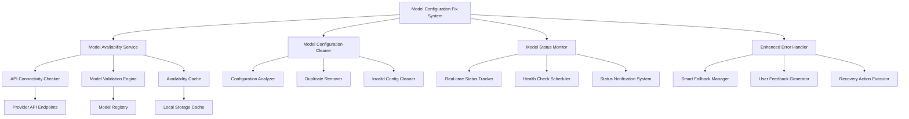

# Design Document

## Overview

本设计文档旨在解决用户反映的模型选择器中配置了许多模型但实际无法正常工作的问题。通过分析现有代码，我们发现问题主要集中在：

1. **硬编码模型配置**：ModelSelector组件中存在大量硬编码的模型ID，但缺乏对应的API实现验证
2. **缺乏模型可用性检查**：系统没有在启动时验证配置的模型是否真正可用
3. **错误处理不完善**：虽然有ModelErrorHandler，但缺乏主动的模型状态监控
4. **用户反馈不清晰**：用户无法清楚了解哪些模型可用、哪些不可用以及原因

本设计将创建一个完整的模型配置修复和优化系统，确保所有显示的模型都能正常工作。

## Architecture



## Components and Interfaces

### 1. Model Availability Service

负责检查和验证模型的可用性状态。

```typescript
interface ModelAvailabilityService {
  // 检查单个模型可用性
  checkModelAvailability(modelId: string, generationType: 'text' | 'image' | 'video'): Promise<ModelAvailabilityResult>;
  
  // 批量检查模型可用性
  checkBatchAvailability(models: ModelCheckRequest[]): Promise<ModelAvailabilityResult[]>;
  
  // 获取缓存的可用性状态
  getCachedAvailability(modelId: string): ModelAvailabilityResult | null;
  
  // 刷新模型可用性状态
  refreshAvailability(modelId?: string): Promise<void>;
}

interface ModelAvailabilityResult {
  modelId: string;
  isAvailable: boolean;
  status: 'available' | 'unavailable' | 'checking' | 'error';
  lastChecked: number;
  error?: {
    type: 'api_key_missing' | 'endpoint_unreachable' | 'model_not_found' | 'quota_exceeded' | 'network_error';
    message: string;
    details?: any;
  };
  responseTime?: number;
  provider: string;
}

interface ModelCheckRequest {
  modelId: string;
  generationType: 'text' | 'image' | 'video';
  priority: 'high' | 'normal' | 'low';
}
```

### 2. Model Configuration Cleaner

负责清理和优化模型配置。

```typescript
interface ModelConfigurationCleaner {
  // 分析当前配置
  analyzeConfiguration(): ConfigurationAnalysisResult;
  
  // 清理无效配置
  cleanInvalidConfigurations(): CleanupResult;
  
  // 移除重复配置
  removeDuplicates(): CleanupResult;
  
  // 验证配置完整性
  validateConfigurationIntegrity(): ValidationResult;
}

interface ConfigurationAnalysisResult {
  totalModels: number;
  validModels: number;
  invalidModels: string[];
  duplicateModels: string[];
  missingApiImplementations: string[];
  recommendations: ConfigurationRecommendation[];
}

interface ConfigurationRecommendation {
  type: 'remove' | 'fix' | 'merge' | 'add_api';
  modelId: string;
  reason: string;
  action: string;
  priority: 'high' | 'medium' | 'low';
}

interface CleanupResult {
  removedModels: string[];
  mergedModels: Array<{ from: string[]; to: string }>;
  fixedModels: string[];
  summary: string;
}
```

### 3. Model Status Monitor

负责实时监控模型状态和健康度。

```typescript
interface ModelStatusMonitor {
  // 开始监控
  startMonitoring(): void;
  
  // 停止监控
  stopMonitoring(): void;
  
  // 获取模型状态
  getModelStatus(modelId: string): ModelStatus;
  
  // 获取所有模型状态
  getAllModelStatuses(): Map<string, ModelStatus>;
  
  // 订阅状态变化
  subscribeToStatusChanges(callback: (modelId: string, status: ModelStatus) => void): () => void;
}

interface ModelStatus {
  modelId: string;
  health: 'healthy' | 'warning' | 'error' | 'unknown';
  availability: 'available' | 'unavailable' | 'checking';
  lastSuccessfulCall?: number;
  lastFailedCall?: number;
  errorCount: number;
  successRate: number;
  averageResponseTime: number;
  issues: ModelIssue[];
}

interface ModelIssue {
  type: 'performance' | 'availability' | 'configuration' | 'quota';
  severity: 'low' | 'medium' | 'high' | 'critical';
  message: string;
  timestamp: number;
  resolved: boolean;
}
```

### 4. Enhanced Model Selector

增强的模型选择器组件，支持状态显示和错误反馈。

```typescript
interface EnhancedModelSelectorProps extends ModelSelectorProps {
  // 显示模型状态
  showModelStatus?: boolean;
  
  // 显示错误详情
  showErrorDetails?: boolean;
  
  // 自动隐藏不可用模型
  hideUnavailableModels?: boolean;
  
  // 状态变化回调
  onModelStatusChange?: (modelId: string, status: ModelStatus) => void;
  
  // 错误处理回调
  onModelError?: (error: ModelError) => void;
}

interface ModelDisplayInfo extends ModelInfo {
  // 扩展显示信息
  status: ModelStatus;
  displayStatus: 'available' | 'unavailable' | 'checking' | 'error';
  statusMessage?: string;
  canBeSelected: boolean;
  warningMessage?: string;
}
```

## Data Models

### 1. Model Registry

统一的模型注册表，管理所有模型的元数据和状态。

```typescript
interface ModelRegistry {
  // 注册模型
  registerModel(model: ModelRegistration): void;
  
  // 注销模型
  unregisterModel(modelId: string): void;
  
  // 获取模型信息
  getModel(modelId: string): RegisteredModel | null;
  
  // 获取所有模型
  getAllModels(): RegisteredModel[];
  
  // 按类型获取模型
  getModelsByType(generationType: 'text' | 'image' | 'video'): RegisteredModel[];
  
  // 按提供商获取模型
  getModelsByProvider(provider: string): RegisteredModel[];
}

interface ModelRegistration {
  modelInfo: ModelInfo;
  apiImplementation: ModelApiImplementation;
  healthCheckConfig: HealthCheckConfig;
  fallbackModels?: string[];
}

interface RegisteredModel extends ModelInfo {
  apiImplementation: ModelApiImplementation;
  healthCheckConfig: HealthCheckConfig;
  fallbackModels: string[];
  registrationTime: number;
  lastValidated: number;
}

interface ModelApiImplementation {
  hasImplementation: boolean;
  endpoint?: string;
  requiredCredentials: string[];
  testMethod?: () => Promise<boolean>;
  supportedFeatures: string[];
}

interface HealthCheckConfig {
  enabled: boolean;
  interval: number; // milliseconds
  timeout: number; // milliseconds
  retryCount: number;
  testPrompt?: string;
}
```

### 2. Configuration Storage

配置存储和管理系统。

```typescript
interface ConfigurationStorage {
  // 保存配置
  saveConfiguration(config: ModelConfiguration): Promise<void>;
  
  // 加载配置
  loadConfiguration(): Promise<ModelConfiguration>;
  
  // 备份配置
  backupConfiguration(): Promise<string>;
  
  // 恢复配置
  restoreConfiguration(backupId: string): Promise<void>;
  
  // 获取配置历史
  getConfigurationHistory(): Promise<ConfigurationHistoryEntry[]>;
}

interface ModelConfiguration {
  version: string;
  lastUpdated: number;
  models: {
    text: RegisteredModel[];
    image: RegisteredModel[];
    video: RegisteredModel[];
  };
  providers: Record<string, ProviderConfiguration>;
  userPreferences: UserModelPreferences;
  systemSettings: SystemSettings;
}

interface ProviderConfiguration {
  name: string;
  enabled: boolean;
  credentials: Record<string, string>;
  endpoints: Record<string, string>;
  rateLimits: RateLimitConfig;
  healthCheck: ProviderHealthCheckConfig;
}

interface SystemSettings {
  autoCleanup: boolean;
  healthCheckInterval: number;
  maxErrorRetries: number;
  cacheTimeout: number;
  enableTelemetry: boolean;
}
```

## Correctness Properties

*A property is a characteristic or behavior that should hold true across all valid executions of a system-essentially, a formal statement about what the system should do. Properties serve as the bridge between human-readable specifications and machine-verifiable correctness guarantees.*

Based on the prework analysis of acceptance criteria, the following properties ensure the correctness of the model configuration fix system:

### Property 1: Model ID Mapping Correctness
*For any* supported model (Gemini, image, or video), when the Model_ID_Mapper maps the internal model name to an API identifier, it should return the exact identifier expected by the Shenma API and maintain consistency with working model mappings.
**Validates: Requirements 1.1, 1.2, 1.3, 1.4, 1.5**

### Property 2: Parameter Format Validation
*For any* model type and parameter set, when the Parameter_Formatter processes the parameters, it should use the correct structure required by the Shenma API for that model type and reject invalid parameter combinations while preserving formats that work for existing successful models.
**Validates: Requirements 2.1, 2.2, 2.3, 2.4, 2.5**

### Property 3: Model-Specific Parameter Transformation
*For any* model request, when the Model_Configuration_System processes it, it should apply the correct model-specific parameter transformations (Gemini, image, or video) while maintaining backward compatibility with existing working configurations.
**Validates: Requirements 3.1, 3.2, 3.3, 3.4, 3.5**

### Property 4: Error Logging and Aggregation
*For any* model configuration error, when the Error_Handler processes it, it should log the exact API request and response for debugging and aggregate multiple errors to identify systematic issues.
**Validates: Requirements 4.3, 4.4**

### Property 5: Fallback Mechanism Activation
*For any* model failure, when a working alternative model exists, the Error_Handler should provide fallback mechanisms to redirect to the working model.
**Validates: Requirements 4.5**

### Property 6: Configuration Validation Completeness
*For any* model configuration validation run, the Model_Configuration_System should test all problematic models against the Shenma API, verify model ID resolution and parameter format acceptance, and maintain a validation report showing the status of all model configurations.
**Validates: Requirements 5.1, 5.2, 5.3, 5.5**

### Property 7: Unified Interface Consistency
*For any* model request regardless of type, the Model_Configuration_System should provide a unified interface, handle transitions transparently, abstract parameter complexity, ensure consistent response formats, and provide the same error handling interface.
**Validates: Requirements 6.1, 6.2, 6.3, 6.4, 6.5**

## Error Handling

### Error Classification System

The system implements a comprehensive error classification to handle different types of model configuration failures:

```typescript
enum ModelConfigurationErrorType {
  MODEL_ID_MAPPING_ERROR = 'model_id_mapping_error',
  PARAMETER_FORMAT_ERROR = 'parameter_format_error',
  API_CONNECTIVITY_ERROR = 'api_connectivity_error',
  AUTHENTICATION_ERROR = 'authentication_error',
  QUOTA_EXCEEDED_ERROR = 'quota_exceeded_error',
  MODEL_NOT_SUPPORTED_ERROR = 'model_not_supported_error',
  CONFIGURATION_VALIDATION_ERROR = 'configuration_validation_error'
}

interface ModelConfigurationError extends Error {
  type: ModelConfigurationErrorType;
  modelId: string;
  provider: string;
  details: {
    originalRequest?: any;
    apiResponse?: any;
    suggestedFix?: string;
    fallbackModels?: string[];
  };
  timestamp: number;
  retryable: boolean;
}
```

### Error Recovery Strategies

1. **Automatic Fallback**: When a model fails, automatically try fallback models in order of preference
2. **Configuration Auto-Fix**: Attempt to automatically correct common configuration issues
3. **User Notification**: Provide clear, actionable error messages to users
4. **Logging and Telemetry**: Comprehensive logging for debugging and system monitoring

### Graceful Degradation

The system ensures graceful degradation when models are unavailable:

- Hide unavailable models from the UI
- Provide alternative model suggestions
- Maintain core functionality with working models
- Cache error states to avoid repeated failed attempts

## Testing Strategy

### Dual Testing Approach

The testing strategy combines unit tests for specific scenarios with property-based tests for comprehensive coverage:

**Unit Tests Focus:**
- Specific model configuration scenarios (Gemini, nano-banana-hd, flux-dev, sora_video2-portrait)
- Error handling edge cases
- API integration points
- Configuration validation examples

**Property-Based Tests Focus:**
- Universal properties across all model types
- Parameter transformation correctness
- Error handling consistency
- Configuration validation completeness

### Property-Based Testing Configuration

- **Testing Library**: Use fast-check for TypeScript/JavaScript property-based testing
- **Test Iterations**: Minimum 100 iterations per property test
- **Test Tagging**: Each property test tagged with format: **Feature: model-configuration-fix, Property {number}: {property_text}**

### Test Coverage Requirements

1. **Model ID Mapping Tests**: Verify correct mapping for all supported models
2. **Parameter Format Tests**: Validate parameter formatting for each model type
3. **Error Handling Tests**: Test error scenarios and recovery mechanisms
4. **Configuration Validation Tests**: Verify configuration validation completeness
5. **Integration Tests**: Test end-to-end model configuration and usage flows

### Mock and Stub Strategy

- Mock Shenma API responses for consistent testing
- Stub network calls to test offline scenarios
- Create test fixtures for different model configurations
- Use dependency injection for testable architecture

## Implementation Notes

### Migration Strategy

1. **Phase 1**: Implement model availability checking without breaking existing functionality
2. **Phase 2**: Add configuration validation and cleanup tools
3. **Phase 3**: Enhance error handling and user feedback
4. **Phase 4**: Implement real-time monitoring and health checks

### Performance Considerations

- Cache model availability results to avoid repeated API calls
- Implement background health checks to minimize user-facing delays
- Use lazy loading for model configurations
- Optimize batch operations for multiple model checks

### Security Considerations

- Secure storage of API credentials
- Rate limiting for API calls to prevent abuse
- Input validation for all configuration parameters
- Audit logging for configuration changes

### Monitoring and Observability

- Metrics for model availability and performance
- Alerts for systematic model failures
- Dashboard for model health status
- Telemetry for usage patterns and error rates