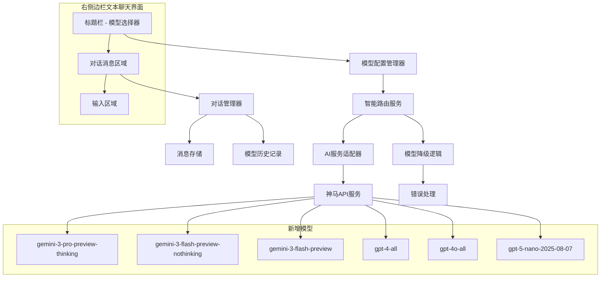

# 设计文档

## 概述

本设计文档描述了在曹操画布项目的右侧边栏文本聊天中实现多模型选择功能的技术方案。该功能将允许用户从多个文本生成模型中进行选择，包括Gemini 3.0系列、GPT-4-all、GPT-4o-all和GPT-5-nano等新模型，同时保持对话历史记录和向后兼容性。

## 架构

### 整体架构图



### UI集成详细设计

**现有AIAssistant组件修改**：
```typescript
// 在AIAssistant组件的标题栏添加模型选择器
<div className="chat-header">
  <h3>💬 文本聊天</h3>
  <div className="header-controls">
    <ModelSelector 
      currentModel={currentModel}
      availableModels={availableModels}
      onModelChange={handleModelChange}
      theme={theme}
      lang={lang}
    />
    <button onClick={onClose}>✕</button>
  </div>
</div>
```

**选择器下拉菜单设计**：
```
┌─────────────────────────────────────┐
│ 💬 文本聊天    [Gemini 3 Pro ▼] ✕  │
├─────────────────────────────────────┤
│ ┌─ 模型选择 ─────────────────────┐   │
│ │ 🚀 快速轻量型                   │   │
│ │   • Gemini 3 Flash (快速)      │   │
│ │   • Gemini 3 Flash            │   │
│ │                               │   │
│ │ 🧠 深度分析型                   │   │
│ │   • Gemini 3 Pro Thinking ⭐   │   │
│ │   • GPT-4 All 🌐              │   │
│ │   • GPT-4o All 🌐🎭           │   │
│ │                               │   │
│ │ 🤔 推理专用型                   │   │
│ │   • GPT-5 Nano                │   │
│ └───────────────────────────────────┘   │
│                                     │
│  对话消息区域                        │
└─────────────────────────────────────┘
```

**图标说明**：
- ⭐ = 推荐模型
- 🌐 = 联网功能
- 🎭 = 全模态支持

### 核心组件关系

1. **模型选择器** → **模型配置管理器** → **智能路由服务** → **AI服务适配器**
2. **对话管理器** ↔ **模型选择器**（保持对话历史）
3. **智能路由服务** → **模型降级逻辑**（处理模型不可用情况）

## 组件和接口

### 0. 模型选择器位置和布局

**位置选择**：模型选择器将添加到右侧边栏文本聊天界面的标题区域

**具体位置**：

**方案1：在输入框右侧**
```
┌─────────────────────────────────────┐
│ [文本] [图片] [视频]                 │  ← 模式切换标签
├─────────────────────────────────────┤
│ 💬 文本聊天                      ✕ │  ← 标题栏
├─────────────────────────────────────┤
│ 用户: 你好                           │
│ 助手: 您好！我是Gemini 3 Pro...      │
│                                     │
│  对话消息区域                        │
│                                     │
├─────────────────────────────────────┤
│ [输入框] [Gemini 3▼] [📎] [发送]    │  ← 输入区域（这里！）
└─────────────────────────────────────┘
```

**方案2：在附件上传行**
```
┌─────────────────────────────────────┐
│ [文本] [图片] [视频]                 │  ← 模式切换标签
├─────────────────────────────────────┤
│ 💬 文本聊天                      ✕ │  ← 标题栏
├─────────────────────────────────────┤
│ 用户: 你好                           │
│ 助手: 您好！我是Gemini 3 Pro...      │
│                                     │
│  对话消息区域                        │
│                                     │
├─────────────────────────────────────┤
│ [Gemini 3 Pro ▼] [📎图片] [📎文件]  │  ← 附件/模型选择行（这里！）
│ [输入框]                    [发送]   │  ← 输入区域
└─────────────────────────────────────┘
```

**最终位置设计：方案2 + 向上展开**

```
┌─────────────────────────────────────┐
│ [文本] [图片] [视频]                 │  ← 模式切换标签
├─────────────────────────────────────┤
│ 💬 文本聊天                      ✕ │  ← 标题栏
├─────────────────────────────────────┤
│ 用户: 你好                           │
│ 助手: 您好！我是Gemini 3 Pro...      │
│ ┌─ 模型选择 ─────────────────────┐   │  ← 向上展开的下拉菜单
│ │ 🚀 快速轻量型                   │   │
│ │   • Gemini 3 Flash (快速)      │   │
│ │ 🧠 深度分析型                   │   │
│ │   • Gemini 3 Pro Thinking ⭐   │   │
│ │   • GPT-4o All 🌐🎭           │   │
│ └───────────────────────────────────┘   │
├─────────────────────────────────────┤
│ [Gemini 3 Pro ▼] [📎图片] [📎文件]  │  ← 配置行（这里！）
│ [输入框...                      ] [发送] │  ← 输入区域
└─────────────────────────────────────┘
```

**关键设计要点**：
- ✅ **位置**：在附件上传按钮同一行，输入框上方
- ✅ **展开方向**：向上展开，避免被页面底部截断
- ✅ **空间利用**：利用对话区域的空间显示下拉菜单
- ✅ **用户体验**：点击模型名称向上弹出选择菜单

**技术实现**：
```typescript
// 下拉菜单定位
const dropdownStyle = {
  position: 'absolute',
  bottom: '100%', // 向上展开
  left: 0,
  marginBottom: '8px',
  zIndex: 1000
};
```

**响应式处理**：
- 桌面端：完整显示模型名称 "Gemini 3 Pro ▼"
- 移动端：简化显示 "G3P ▼" 或图标

**集成到现有组件**：
- 在AIAssistant组件的标题栏中添加模型选择器
- 位于聊天标题右侧，不干扰现有的关闭按钮等控件
- 采用下拉菜单形式，节省空间
- 显示当前选中的模型名称和类型图标

**响应式设计**：
- 桌面端：完整显示模型名称和类型
- 移动端：只显示模型类型图标，点击展开详情

### 1. 模型选择器组件 (ModelSelector)

```typescript
interface ModelSelectorProps {
  currentModel: string;
  availableModels: ModelInfo[];
  onModelChange: (modelId: string) => void;
  disabled?: boolean;
  theme: 'light' | 'dark';
  lang: 'zh' | 'en';
}

interface ModelInfo {
  id: string;
  name: string;
  type: ModelType;
  capabilities: ModelCapability[];
  description: string;
  isOnline?: boolean;
  isMultimodal?: boolean;
  isRecommended?: boolean;
}

enum ModelType {
  FAST_LIGHTWEIGHT = 'fast-lightweight',
  DEEP_ANALYSIS = 'deep-analysis', 
  REASONING = 'reasoning',
  ONLINE = 'online',
  MULTIMODAL = 'multimodal'
}

enum ModelCapability {
  TEXT = 'text',
  IMAGE_ANALYSIS = 'image-analysis',
  VIDEO_ANALYSIS = 'video-analysis',
  ONLINE_SEARCH = 'online-search',
  REASONING = 'reasoning',
  FAST_RESPONSE = 'fast-response'
}
```

### 2. 模型配置管理器 (ModelConfigManager)

```typescript
interface ModelConfigManager {
  // 获取可用的文本模型列表
  getAvailableTextModels(): ModelInfo[];
  
  // 获取模型详细信息
  getModelInfo(modelId: string): ModelInfo | null;
  
  // 检查模型是否可用
  isModelAvailable(modelId: string): Promise<boolean>;
  
  // 获取默认模型
  getDefaultModel(): string;
  
  // 获取推荐模型
  getRecommendedModel(contentType: ContentType): string;
  
  // 更新模型配置
  updateModelConfig(config: Partial<NewModelConfig>): void;
}

// 新增模型配置
const NEW_TEXT_MODELS: Record<string, ModelInfo> = {
  'gemini-3-pro-preview-thinking': {
    id: 'gemini-3-pro-preview-thinking',
    name: 'Gemini 3 Pro Thinking',
    type: ModelType.REASONING,
    capabilities: [
      ModelCapability.TEXT,
      ModelCapability.IMAGE_ANALYSIS,
      ModelCapability.VIDEO_ANALYSIS,
      ModelCapability.ONLINE_SEARCH,
      ModelCapability.REASONING
    ],
    description: '最新Gemini 3 Pro模型，具备强大的推理能力和全模态支持',
    isOnline: true,
    isMultimodal: true,
    isRecommended: true
  },
  'gemini-3-flash-preview-nothinking': {
    id: 'gemini-3-flash-preview-nothinking',
    name: 'Gemini 3 Flash (快速)',
    type: ModelType.FAST_LIGHTWEIGHT,
    capabilities: [ModelCapability.TEXT, ModelCapability.FAST_RESPONSE],
    description: '快速响应的Gemini 3模型，适合简单对话',
    isOnline: false,
    isMultimodal: false
  },
  'gemini-3-flash-preview': {
    id: 'gemini-3-flash-preview',
    name: 'Gemini 3 Flash',
    type: ModelType.FAST_LIGHTWEIGHT,
    capabilities: [
      ModelCapability.TEXT,
      ModelCapability.IMAGE_ANALYSIS,
      ModelCapability.FAST_RESPONSE
    ],
    description: '平衡速度和功能的Gemini 3模型',
    isOnline: false,
    isMultimodal: true
  },
  'gpt-4-all': {
    id: 'gpt-4-all',
    name: 'GPT-4 All',
    type: ModelType.DEEP_ANALYSIS,
    capabilities: [
      ModelCapability.TEXT,
      ModelCapability.IMAGE_ANALYSIS,
      ModelCapability.ONLINE_SEARCH
    ],
    description: 'GPT-4全功能版本，支持联网和图像分析',
    isOnline: true,
    isMultimodal: true
  },
  'gpt-4o-all': {
    id: 'gpt-4o-all',
    name: 'GPT-4o All',
    type: ModelType.MULTIMODAL,
    capabilities: [
      ModelCapability.TEXT,
      ModelCapability.IMAGE_ANALYSIS,
      ModelCapability.VIDEO_ANALYSIS,
      ModelCapability.ONLINE_SEARCH
    ],
    description: 'GPT-4o全模态版本，支持文本、图像、视频和联网',
    isOnline: true,
    isMultimodal: true,
    isRecommended: true
  },
  'gpt-5-nano-2025-08-07': {
    id: 'gpt-5-nano-2025-08-07',
    name: 'GPT-5 Nano',
    type: ModelType.REASONING,
    capabilities: [ModelCapability.TEXT, ModelCapability.REASONING],
    description: 'GPT-5轻量版，专注于推理和逻辑分析',
    isOnline: false,
    isMultimodal: false
  }
};
```

### 3. 增强的智能路由服务 (EnhancedSmartRoutingService)

```typescript
interface EnhancedSmartRoutingService extends SmartRoutingService {
  // 修复图像分析路由
  fixImageAnalysisRouting(contents: any, userSelectedModel: string): ProviderSettings;
  
  // 检查模型是否支持特定功能
  supportsCapability(modelId: string, capability: ModelCapability): boolean;
  
  // 获取模型降级策略
  getModelFallbackStrategy(modelId: string): string[];
  
  // 智能模型推荐
  recommendModelForContent(contents: any): ModelRecommendation;
}

interface ModelRecommendation {
  primaryModel: string;
  fallbackModels: string[];
  reason: string;
  confidence: number;
}
```

### 4. 对话管理器增强 (ConversationManager)

```typescript
interface ConversationManager {
  // 切换模型时保持对话历史
  switchModel(newModelId: string): void;
  
  // 添加消息时记录使用的模型
  addMessage(message: ChatMessage, modelId: string): void;
  
  // 获取对话历史（包含模型信息）
  getConversationHistory(): ConversationMessage[];
  
  // 清理对话历史
  clearHistory(): void;
  
  // 导出对话历史
  exportHistory(): ConversationExport;
}

interface ConversationMessage extends ChatMessage {
  modelId: string;
  modelName: string;
  timestamp: Date;
  tokenUsage?: {
    input: number;
    output: number;
    total: number;
  };
}
```

## 数据模型

### 1. 扩展的NewModelConfig

```typescript
interface ExtendedNewModelConfig extends NewModelConfig {
  // 文本模型配置扩展
  text: {
    provider: ProviderType;
    modelId: string;
    // 新增：用户偏好设置
    userPreferences?: {
      defaultModel: string;
      autoSwitchForImages: boolean;
      autoSwitchForVideos: boolean;
      preferOnlineModels: boolean;
    };
    // 新增：模型可用性缓存
    modelAvailability?: Record<string, {
      available: boolean;
      lastChecked: number;
      errorMessage?: string;
    }>;
  };
}
```

### 2. 模型选择状态

```typescript
interface ModelSelectionState {
  currentModel: string;
  availableModels: ModelInfo[];
  isLoading: boolean;
  error?: string;
  lastSwitchTime: number;
  switchHistory: ModelSwitchRecord[];
}

interface ModelSwitchRecord {
  fromModel: string;
  toModel: string;
  timestamp: Date;
  reason: 'user-selection' | 'auto-fallback' | 'content-optimization';
  success: boolean;
}
```

### 3. 用户界面状态

```typescript
interface ChatUIState {
  modelSelector: {
    isOpen: boolean;
    selectedCategory: ModelType | 'all';
    searchQuery: string;
    sortBy: 'name' | 'type' | 'recommendation';
  };
  currentConversation: {
    modelId: string;
    messageCount: number;
    hasImages: boolean;
    hasVideos: boolean;
  };
  notifications: UINotification[];
}

interface UINotification {
  id: string;
  type: 'info' | 'warning' | 'error' | 'success';
  message: string;
  action?: {
    label: string;
    callback: () => void;
  };
  autoHide?: boolean;
  duration?: number;
}
```

## 正确性属性

*属性是一个特征或行为，应该在系统的所有有效执行中保持为真——本质上是关于系统应该做什么的正式陈述。属性作为人类可读规范和机器可验证正确性保证之间的桥梁。*

现在我需要使用prework工具来分析验收标准，然后编写正确性属性。

基于预工作分析，我将创建以下正确性属性：

### 属性1：模型选择器显示完整性
*对于任何*可用模型列表，模型选择器应显示所有模型，并按类型正确分组，每个模型都包含名称、类型标识和功能说明
**验证：需求 1.1, 1.2, 1.5**

### 属性2：模型切换状态一致性
*对于任何*模型切换操作，系统应正确更新当前模型状态，UI应反映新选择的模型，并且对话历史应完整保留
**验证：需求 1.3, 3.1, 3.4, 6.2**

### 属性3：智能模型推荐正确性
*对于任何*用户输入内容，系统应根据内容类型（快速响应、复杂问题、推理、实时信息、多媒体）推荐相应类型的模型
**验证：需求 2.1, 2.2, 2.3, 2.4, 2.5**

### 属性4：配置驱动的模型可用性
*对于任何*NewModelConfig配置，系统应正确读取可用模型，排除禁用的模型，并处理无效配置的错误情况
**验证：需求 4.1, 4.2, 4.3, 8.1, 8.2**

### 属性5：模型使用一致性
*对于任何*用户消息，系统应使用当前选定的模型进行处理，API调用应包含正确的模型ID，消息应标记生成模型
**验证：需求 5.1, 5.2, 3.3**

### 属性6：多模态内容智能路由
*对于任何*包含图像的输入内容，系统应自动检测多模态内容并选择支持图像分析的模型，除非用户已明确选择了兼容模型
**验证：需求 9.1, 9.2, 9.3**

### 属性7：模型能力标识正确性
*对于任何*模型，UI应正确显示其能力标识（联网、全模态等），并且系统应支持相应的输入类型
**验证：需求 10.1, 11.1**

### 属性8：向后兼容性保持
*对于任何*现有聊天功能，在启用多模型功能后应继续正常工作，默认行为应与配置一致
**验证：需求 7.1, 7.2**

## 错误处理

### 错误分类和处理策略

1. **模型不可用错误**
   - 检测：API调用失败、模型响应超时
   - 处理：显示用户友好错误消息，自动降级到备用模型
   - 用户操作：提供模型切换建议

2. **配置错误**
   - 检测：API密钥无效、配置格式错误
   - 处理：显示配置指导信息，禁用受影响模型
   - 用户操作：引导用户到配置页面

3. **网络错误**
   - 检测：网络连接失败、请求超时
   - 处理：显示网络状态，提供重试选项
   - 用户操作：重试按钮、离线模式提示

4. **内容兼容性错误**
   - 检测：模型不支持当前内容类型
   - 处理：自动切换到兼容模型或提示用户切换
   - 用户操作：模型切换建议

### 错误恢复机制

```typescript
interface ErrorRecoveryStrategy {
  // 自动降级策略
  autoFallback: {
    enabled: boolean;
    maxRetries: number;
    fallbackChain: string[];
  };
  
  // 用户通知策略
  userNotification: {
    showErrorDetails: boolean;
    suggestAlternatives: boolean;
    autoHideDelay: number;
  };
  
  // 状态恢复策略
  stateRecovery: {
    preserveConversation: boolean;
    restoreLastWorkingModel: boolean;
    cacheFailedAttempts: boolean;
  };
}
```

## 测试策略

### 双重测试方法

本系统将采用单元测试和属性测试相结合的综合测试策略：

**单元测试重点**：
- 特定的用户交互场景（点击、选择、切换）
- 边界条件和错误情况
- 组件集成点
- 默认值和配置加载

**属性测试重点**：
- 模型选择和切换的通用行为
- 智能路由的决策逻辑
- 对话历史的完整性保持
- 配置变化的系统响应

### 属性测试配置

- **最小迭代次数**：每个属性测试运行100次迭代
- **测试库**：使用fast-check（JavaScript/TypeScript属性测试库）
- **标记格式**：每个测试标记为 **Feature: multi-model-text-chat, Property {number}: {property_text}**

### 测试数据生成策略

```typescript
// 模型配置生成器
const modelConfigArbitrary = fc.record({
  availableModels: fc.array(fc.record({
    id: fc.string(),
    name: fc.string(),
    type: fc.constantFrom(...Object.values(ModelType)),
    capabilities: fc.array(fc.constantFrom(...Object.values(ModelCapability))),
    isAvailable: fc.boolean()
  })),
  defaultModel: fc.string(),
  userPreferences: fc.record({
    preferOnlineModels: fc.boolean(),
    autoSwitchForImages: fc.boolean()
  })
});

// 对话内容生成器
const conversationContentArbitrary = fc.record({
  messages: fc.array(fc.record({
    text: fc.string(),
    hasImages: fc.boolean(),
    hasVideos: fc.boolean(),
    timestamp: fc.date()
  })),
  currentModel: fc.string()
});
```

### 集成测试场景

1. **端到端模型切换流程**
   - 用户选择模型 → 发送消息 → 验证响应来源
   
2. **智能路由触发场景**
   - 上传图像 → 验证模型自动切换 → 验证分析结果

3. **错误恢复场景**
   - 模拟API失败 → 验证降级行为 → 验证用户通知

4. **配置更新场景**
   - 更新模型配置 → 验证UI更新 → 验证功能可用性

### 性能测试要求

虽然具体的时间要求（如100ms、200ms）难以在属性测试中精确验证，但我们将通过以下方式确保性能：

1. **响应时间监控**：记录关键操作的执行时间
2. **性能回归测试**：确保新功能不影响现有性能
3. **用户体验测试**：验证UI响应的流畅性
4. **负载测试**：测试多个模型同时可用时的性能

## 实现优先级

### 第一阶段：核心功能
1. 模型选择器UI组件
2. 基础模型配置管理
3. 简单的模型切换功能
4. 对话历史保持

### 第二阶段：智能功能
1. 智能路由修复
2. 模型推荐系统
3. 错误处理和降级
4. 用户偏好设置

### 第三阶段：高级功能
1. 性能优化
2. 高级错误恢复
3. 用户体验增强
4. 监控和分析

## 技术约束

### 兼容性约束
- 必须与现有NewModelConfig结构兼容
- 必须保持现有AI服务适配器接口不变
- 必须支持现有的图像和视频模型配置

### 性能约束
- 模型切换响应时间 < 100ms
- 加载指示器显示时间 < 200ms
- 模型列表加载时间 < 500ms

### 安全约束
- API密钥安全存储和传输
- 用户对话数据隐私保护
- 模型访问权限控制

### 可扩展性约束
- 支持未来新增模型类型
- 支持自定义模型配置
- 支持第三方模型集成