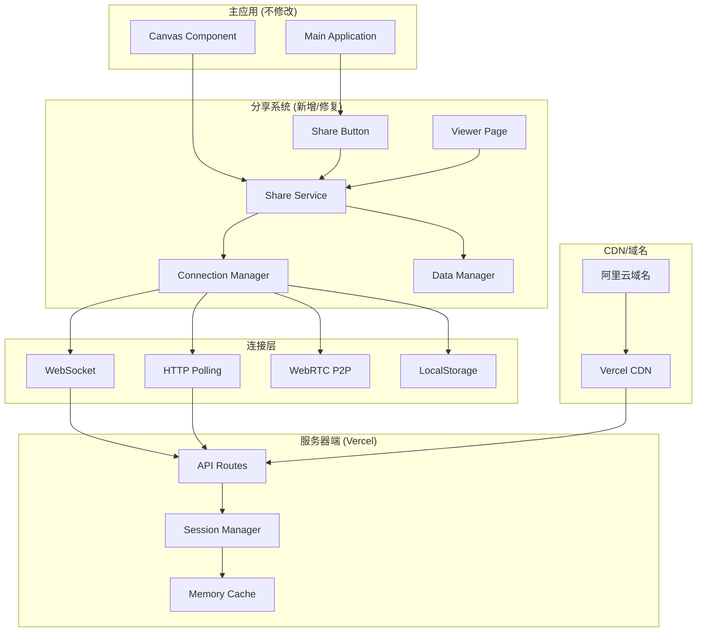

# Design Document

## Overview

本设计文档针对实时同屏分享功能的修复和优化，基于现有的Vercel + 阿里云域名架构，为中国用户提供稳定可靠的实时协作体验。设计重点关注连接稳定性、同步性能优化、用户体验改进，确保不修改主应用代码的前提下，全面提升分享功能的质量。

### 核心设计原则

1. **零侵入性**: 不修改主应用代码，通过独立的服务和组件实现功能
2. **中国网络优化**: 针对中国网络环境进行特殊优化和适配
3. **多重备份**: 提供多种连接方案，确保在各种网络条件下都能正常工作
4. **渐进增强**: 从基础功能开始，逐步增加高级特性
5. **用户体验优先**: 优化界面响应和错误处理，提供清晰的状态反馈

## Architecture

### 整体架构图



### 分层设计

1. **表现层**: 分享按钮和观看页面组件
2. **服务层**: 分享服务和连接管理
3. **传输层**: 多种数据传输方案
4. **存储层**: 会话管理和数据缓存

## Components and Interfaces

### 1. Enhanced Realtime Share Service

```typescript
interface EnhancedRealtimeShareService {
  // 核心功能
  createSession(title: string, canvasState: CanvasState): Promise<SessionResult>;
  joinSession(sessionId: string): Promise<SessionData>;
  updateCanvas(canvasState: CanvasState): Promise<void>;
  endSession(): Promise<void>;
  
  // 连接管理
  getConnectionStatus(): ConnectionStatus;
  switchConnectionMode(mode: ConnectionMode): Promise<void>;
  retryConnection(): Promise<boolean>;
  
  // 性能优化
  enableCompression(enabled: boolean): void;
  setUpdateThrottle(milliseconds: number): void;
  optimizeForNetwork(quality: NetworkQuality): void;
  
  // 监控和诊断
  getPerformanceMetrics(): PerformanceMetrics;
  getDiagnosticInfo(): DiagnosticInfo;
  exportSessionLog(): SessionLog;
}
```

### 2. Improved Viewer Component

```typescript
interface ImprovedViewerComponent {
  // 渲染优化
  renderCanvas(canvasState: CanvasState): void;
  updateCanvasIncremental(changes: CanvasChanges): void;
  optimizeRendering(deviceInfo: DeviceInfo): void;
  
  // 状态管理
  showConnectionStatus(status: ConnectionStatus): void;
  displayLoadingState(progress: number): void;
  handleError(error: ShareError): void;
  
  // 用户交互
  enableAutoRefresh(enabled: boolean): void;
  setRefreshInterval(seconds: number): void;
  showViewerControls(visible: boolean): void;
}
```

### 3. Smart Connection Manager

```typescript
interface SmartConnectionManager {
  // 连接策略
  detectBestConnection(): Promise<ConnectionMode>;
  establishConnection(mode: ConnectionMode): Promise<Connection>;
  maintainConnection(connection: Connection): void;
  
  // 故障恢复
  handleConnectionLoss(): Promise<void>;
  attemptReconnection(): Promise<boolean>;
  switchToBackupConnection(): Promise<void>;
  
  // 性能监控
  monitorConnectionQuality(): ConnectionQuality;
  adjustTransmissionRate(quality: ConnectionQuality): void;
  logConnectionEvents(event: ConnectionEvent): void;
}
```

### 4. Data Synchronization Manager

```typescript
interface DataSynchronizationManager {
  // 数据处理
  compressCanvasData(data: CanvasState): CompressedData;
  decompressCanvasData(data: CompressedData): CanvasState;
  calculateDataDiff(oldState: CanvasState, newState: CanvasState): DataDiff;
  
  // 同步控制
  queueUpdate(update: CanvasUpdate): void;
  processUpdateQueue(): Promise<void>;
  mergeUpdates(updates: CanvasUpdate[]): CanvasUpdate;
  
  // 缓存管理
  cacheCanvasState(sessionId: string, state: CanvasState): void;
  getCachedState(sessionId: string): CanvasState | null;
  clearExpiredCache(): void;
}
```

## Data Models

### Session Data Model

```typescript
interface EnhancedSession {
  id: string;
  hostId: string;
  title: string;
  createdAt: number;
  lastUpdate: number;
  expiresAt: number;
  
  // 画布数据
  canvasState: CanvasState;
  canvasHistory: CanvasState[];
  
  // 参与者信息
  host: HostInfo;
  viewers: ViewerInfo[];
  maxViewers: number;
  
  // 连接信息
  connectionMode: ConnectionMode;
  connectionQuality: ConnectionQuality;
  
  // 配置选项
  settings: SessionSettings;
  
  // 状态标识
  isActive: boolean;
  isPaused: boolean;
  isRecording: boolean;
}

interface CanvasState {
  blocks: Block[];
  connections: Connection[];
  zoom: number;
  pan: { x: number; y: number };
  viewport: Viewport;
  metadata: CanvasMetadata;
}

interface ViewerInfo {
  id: string;
  joinTime: number;
  lastSeen: number;
  connectionType: string;
  userAgent: string;
  networkInfo: NetworkInfo;
}
```

### Connection Models

```typescript
interface ConnectionStatus {
  isConnected: boolean;
  mode: ConnectionMode;
  quality: ConnectionQuality;
  latency: number;
  bandwidth: number;
  errorCount: number;
  lastError?: string;
}

interface ConnectionMode {
  type: 'websocket' | 'polling' | 'p2p' | 'hybrid';
  priority: number;
  fallbackMode?: ConnectionMode;
  config: ConnectionConfig;
}

interface NetworkQuality {
  level: 'excellent' | 'good' | 'fair' | 'poor';
  bandwidth: number;
  latency: number;
  stability: number;
  recommendation: string;
}
```

### Performance Models

```typescript
interface PerformanceMetrics {
  // 连接性能
  connectionTime: number;
  reconnectionCount: number;
  dataTransferRate: number;
  
  // 渲染性能
  renderTime: number;
  frameRate: number;
  memoryUsage: number;
  
  // 用户体验
  loadTime: number;
  errorRate: number;
  userSatisfaction: number;
}

interface DiagnosticInfo {
  browserInfo: BrowserInfo;
  networkInfo: NetworkInfo;
  deviceInfo: DeviceInfo;
  errorLog: ErrorLog[];
  performanceLog: PerformanceLog[];
}
```

## Correctness Properties

*A property is a characteristic or behavior that should hold true across all valid executions of a system-essentially, a formal statement about what the system should do. Properties serve as the bridge between human-readable specifications and machine-verifiable correctness guarantees.*

### Property 1: Connection Stability and Recovery
*For any* network condition or connection failure, the system should establish stable connections, automatically recover from interruptions, and maintain session continuity within 10 seconds.
**Validates: Requirements 2.1, 2.2, 5.1, 5.3**

### Property 2: Data Transmission Efficiency
*For any* canvas state change, the system should transmit updates within 500ms using compression and incremental updates, ensuring data integrity and optimal network usage.
**Validates: Requirements 2.3, 6.1, 6.2, 6.3**

### Property 3: Comprehensive Error Handling
*For any* error condition, the system should provide specific error information, actionable solutions, and recovery options while preserving user data and session state.
**Validates: Requirements 3.2, 4.3, 7.1, 7.2, 7.3, 7.4**

### Property 4: Performance Monitoring and Optimization
*For any* system operation, performance metrics should be collected, network quality should be monitored, and transmission parameters should be automatically adjusted for optimal performance.
**Validates: Requirements 1.2, 1.3, 5.2, 6.5, 10.1, 10.2**

### Property 5: Resource Management and Cleanup
*For any* session lifecycle, the system should efficiently manage memory and network resources, clean up expired data, and prevent resource leaks during normal and abnormal termination.
**Validates: Requirements 2.5, 5.5, 9.5, 10.3**

### Property 6: User Interface Responsiveness
*For any* user interaction or system state change, the UI should provide immediate feedback, display appropriate loading states, and maintain responsive controls.
**Validates: Requirements 3.1, 3.4, 4.1, 4.2, 4.4**

### Property 7: Multi-platform Compatibility
*For any* supported browser, device, or network environment, the sharing functionality should work correctly with appropriate adaptations and fallback mechanisms.
**Validates: Requirements 8.1, 9.1, 9.2, 9.3, 9.4**

### Property 8: Data Synchronization Consistency
*For any* canvas state modification, all connected viewers should receive identical updates, and the final state should be consistent across all clients regardless of connection timing.
**Validates: Requirements 6.4**

### Property 9: Configuration and Customization
*For any* sharing session, users should be able to configure sharing modes, adjust quality settings, manage viewer permissions, and customize sharing scope.
**Validates: Requirements 8.2, 8.3, 8.4, 8.5**

### Property 10: Session Analytics and Reporting
*For any* completed sharing session, the system should generate comprehensive usage statistics, quality reports, and diagnostic information for analysis and improvement.
**Validates: Requirements 10.3, 10.4**

## Error Handling

### Error Classification

1. **Network Errors**
   - Connection timeout
   - DNS resolution failure
   - Bandwidth limitations
   - Firewall restrictions

2. **Service Errors**
   - API endpoint unavailable
   - Session not found
   - Authentication failure
   - Rate limiting

3. **Client Errors**
   - Browser compatibility issues
   - Permission denied
   - Local storage full
   - Memory limitations

4. **Data Errors**
   - Corrupted canvas data
   - Serialization failure
   - Version mismatch
   - Size limitations

### Error Handling Strategy

```typescript
interface ErrorHandler {
  // 错误分类和处理
  classifyError(error: Error): ErrorType;
  handleNetworkError(error: NetworkError): Promise<RecoveryAction>;
  handleServiceError(error: ServiceError): Promise<RecoveryAction>;
  handleClientError(error: ClientError): Promise<RecoveryAction>;
  
  // 用户通知
  showErrorMessage(error: ShareError): void;
  suggestSolution(error: ShareError): string[];
  provideRecoveryOptions(error: ShareError): RecoveryOption[];
  
  // 自动恢复
  attemptAutoRecovery(error: ShareError): Promise<boolean>;
  scheduleRetry(action: () => Promise<void>, delay: number): void;
  escalateToManualRecovery(error: ShareError): void;
}
```

### 错误恢复流程

1. **自动恢复**: 系统首先尝试自动解决问题
2. **用户提示**: 如果自动恢复失败，向用户显示清晰的错误信息
3. **解决方案**: 提供具体的解决步骤和替代方案
4. **手动干预**: 允许用户手动重试或选择其他选项
5. **降级服务**: 在必要时提供基础功能而非完全失败

## Testing Strategy

### 双重测试方法

本项目采用单元测试和属性测试相结合的方法：

- **单元测试**: 验证具体的功能实现、边界条件和错误处理
- **属性测试**: 验证系统在各种输入条件下的通用属性和行为

### 单元测试重点

1. **组件功能测试**
   - 分享按钮的状态管理
   - 观看页面的渲染逻辑
   - 服务接口的调用响应

2. **边界条件测试**
   - 网络超时处理
   - 大数据量传输
   - 并发连接限制

3. **集成测试**
   - 组件间的数据流
   - API接口的完整调用
   - 错误传播和处理

### 属性测试配置

- **测试库**: 根据项目技术栈选择合适的属性测试库
- **迭代次数**: 每个属性测试最少100次迭代
- **测试标签**: 每个测试标记为 **Feature: realtime-screen-sharing-fix, Property {number}: {property_text}**

### 测试环境

1. **本地开发环境**: 使用localStorage模拟数据存储
2. **Vercel预览环境**: 测试API路由和服务器功能
3. **生产环境**: 验证阿里云域名和CDN性能
4. **多设备测试**: 覆盖桌面、移动端和不同浏览器

### 性能测试

1. **连接性能**: 测试不同网络条件下的连接建立时间
2. **数据传输**: 验证大量数据的传输效率和准确性
3. **并发处理**: 测试多观众同时连接的系统表现
4. **资源使用**: 监控内存、CPU和网络资源的使用情况

### 兼容性测试

1. **浏览器兼容**: Chrome、Firefox、Safari、Edge等主流浏览器
2. **设备兼容**: 桌面、平板、手机等不同设备
3. **网络环境**: 4G、WiFi、有线网络等不同网络条件
4. **地域测试**: 中国不同地区的网络环境测试