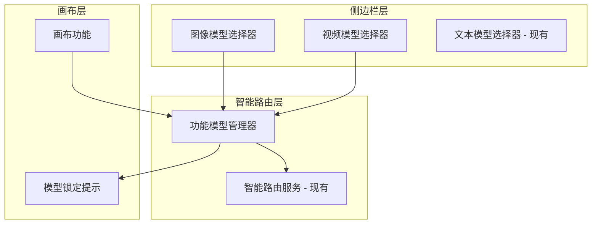

# Design Document: Sidebar Model Selectors

## Overview

基于四个核心原则的简化模型选择系统：

1. **右侧侧边栏模型选择**: 用户可选择图像和视频生成的默认模型
2. **功能智能匹配**: 画布功能自动选择对应模型，智能路由
3. **基于现有模型**: 只使用已配置的可用模型，不添加缺失配置
4. **简单配置**: 避免复杂的模型调用配置，保持简单易用

## 简化架构



核心原则：
- **复用现有**: 扩展现有 ModelSelector 和 SmartRoutingService
- **简单配置**: 基于已有模型列表，不添加复杂配置
- **智能选择**: 功能自动匹配模型，用户友好提醒

## 核心组件

### 1. 扩展的 ModelSelector 组件

复用现有 `ModelSelector.tsx`，添加图像和视频支持：

```typescript
interface ModelSelectorProps {
  generationType: 'text' | 'image' | 'video';
  selectedModel: string;
  onModelChange: (model: string) => void;
  disabled?: boolean;
  lockReason?: string; // 功能锁定时的说明
}
```

### 2. 简化的功能模型管理器

```typescript
interface FeatureModelBinding {
  featureId: string;
  requiredModel: string;
  reason: string;
}

class FeatureModelManager {
  // 获取功能所需模型
  getRequiredModel(featureId: string): string | null;
  
  // 检查是否需要锁定模型
  shouldLockModel(featureId: string, userPreference: string): boolean;
  
  // 获取友好提示信息
  getLockReason(featureId: string): string;
}
```

### 3. 模型配置结构

基于现有可用模型的简单配置：

```typescript
interface SimpleModelConfig {
  availableModels: {
    image: string[];  // 现有可用的图像模型ID列表
    video: string[];  // 现有可用的视频模型ID列表
  };
  featureBindings: FeatureModelBinding[];
  userPreferences: {
    defaultImageModel: string;
    defaultVideoModel: string;
  };
}
```

## 现有可用模型分类

基于当前系统中已配置的模型，按类别整理：

### 图像模型
```typescript
const IMAGE_MODELS = {
  // 基础生成模型
  basic: [
    'nano-banana',      // 神马基础图像模型
    'nano-banana-hd',   // 神马高清图像模型  
    'nano-banana-2',    // 神马图像模型v2
    'gpt-image-1',      // GPT图像模型
    'high-quality'      // 神马高质量模型
  ],
  
  // 高级生成模型
  advanced: [
    'flux-kontext-pro', // Flux专业版
    'flux-kontext-max', // Flux最大版
    'recraftv3',        // Recraft v3
    'dall-e-3',         // DALL-E 3
    'dall-e-2'          // DALL-E 2
  ],
  
  // 编辑专用模型
  editing: [
    'byteedit-v2.0',    // ByteEdit v2.0 (涂抹去除、风格转换)
    'byteedit-enhance'  // ByteEdit 增强
  ]
};
```

### 视频模型
```typescript
const VIDEO_MODELS = {
  // Sora系列
  sora: [
    'sora-2',                    // Sora 2
    'sora-2-pro',               // Sora 2 Pro
    'sora_video2',              // Sora Video 2
    'sora_video2-portrait',     // Sora 竖屏版
    'sora_video2-landscape',    // Sora 横屏版
    'sora_video2-portrait-hd',  // Sora 竖屏高清
    'sora_video2-portrait-15s', // Sora 竖屏15秒
    'sora_video2-portrait-hd-15s' // Sora 竖屏高清15秒
  ],
  
  // Veo系列
  veo: [
    'veo3',           // Veo 3
    'veo3-pro',       // Veo 3 Pro
    'veo3-fast',      // Veo 3 Fast
    'veo3.1',         // Veo 3.1
    'veo3.1-pro'      // Veo 3.1 Pro
  ],
  
  // WanX系列
  wanx: [
    'wanx2.1-vace-plus',    // WanX 2.1 Vace Plus
    'wan2.2-animate-move',  // WanX 2.2 动画移动
    'wan2.2-animate-mix'    // WanX 2.2 动画混合
  ],
  
  // 专用功能
  special: [
    'video-style-transfer',  // 视频风格转换
    'animate-anyone-gen2'    // 人物动画生成
  ]
};
```

### 功能模型绑定
```typescript
const FEATURE_BINDINGS = {
  // 图像编辑功能
  'smear-removal': 'byteedit-v2.0',
  'style-transfer': 'byteedit-v2.0', 
  'background-removal': 'byteedit-v2.0',
  'image-enhance': 'byteedit-enhance',
  
  // 视频特殊功能
  'character-cameo': 'sora-2',
  'video-style-transfer': 'video-style-transfer',
  'character-animation': 'wan2.2-animate-mix'
};
```

这样的简单分类是否符合你的需求？我们可以基于这些现有模型创建侧边栏选择器，不需要额外的复杂配置。
## 简化的正确性属性

基于四个核心原则，简化为关键属性：

### 属性 1: 侧边栏模型选择
*对于任何* 图像或视频模型选择，用户应该能够在侧边栏设置默认模型并持久化存储
**验证: 需求 1.2, 1.3, 1.4**

### 属性 2: 功能智能匹配  
*对于任何* 需要特定模型的画布功能，系统应该自动使用正确的模型，不受用户偏好影响
**验证: 需求 4.1**

### 属性 3: 基础生成偏好尊重
*对于任何* 基础图像或视频生成，系统应该使用用户选择的默认模型
**验证: 需求 4.2, 4.3**

### 属性 4: 友好提醒显示
*对于任何* 模型锁定情况，UI应该显示清晰的说明为什么使用特定模型
**验证: 需求 5.1, 5.2**

### 属性 5: 向后兼容性
*对于任何* 现有功能，添加新模型选择器后应该继续正常工作
**验证: 需求 7.1, 7.2, 7.3, 7.4**

## 简化的错误处理

### 基本错误处理
- **模型不可用**: 显示友好提示，自动降级到默认模型
- **存储失败**: 使用会话存储作为降级方案
- **功能冲突**: 显示简单的锁定说明，解释为什么使用特定模型

### 恢复机制
- **优雅降级**: 所有功能在模型选择失败时使用系统默认值
- **状态恢复**: 损坏的偏好设置自动重置为默认值
- **服务隔离**: 新模型选择系统不影响现有文本聊天功能

## 简化的测试策略

### 单元测试重点
- **特定模型绑定**: 测试涂抹去除绑定到 byteedit-v2.0 等
- **UI组件集成**: 测试 ModelSelector 组件正确渲染
- **向后兼容性**: 测试现有文本聊天模型选择继续工作

### 属性测试配置
使用 **fast-check** 库进行属性测试：
- **最少100次迭代** 确保全面覆盖
- **自定义生成器** 用于模型配置和用户偏好
- **标记测试** 格式: **Feature: sidebar-model-selectors, Property {number}: {property_text}**

### 测试组织
```typescript
describe('Feature: sidebar-model-selectors', () => {
  it('Property 1: 侧边栏模型选择', () => {
    fc.assert(fc.property(
      fc.record({
        generationType: fc.constantFrom('image', 'video'),
        modelId: fc.string(),
        isValid: fc.boolean()
      }),
      (testCase) => {
        // 属性实现
      }
    ), { numRuns: 100 });
  });
});
```

组合确保具体正确性（单元测试）和通用正确性（属性测试），同时保持系统可靠性的信心。