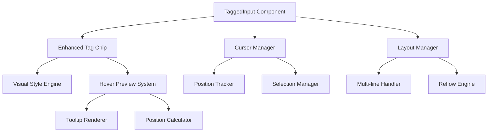

# Design Document: Tag Chip Enhancement System

## Overview

This design document outlines the enhancement of the tag chip system in a React application, focusing on visual design optimization, cursor handling improvements, hover preview functionality, and multi-line text layout optimization. The system builds upon the existing TaggedInput component and insertVariable function while introducing new capabilities for improved user experience.

The design addresses four core areas: enhanced visual styling with improved accessibility, precise cursor positioning in contentEditable contexts, contextual hover previews with intelligent positioning, and robust multi-line text layout handling.

## Architecture

### High-Level Architecture



### Component Hierarchy

- **TaggedInput** (Enhanced): Main container component
  - **EnhancedTagChip**: Individual tag chip with hover and visual enhancements
  - **CursorManager**: Handles cursor positioning and selection management
  - **LayoutManager**: Manages multi-line text flow and positioning
  - **HoverPreview**: Contextual tooltip system

## Components and Interfaces

### Enhanced TaggedInput Component

The core component that orchestrates all tag chip functionality:

```typescript
interface TaggedInputProps {
  value: string;
  onChange: (value: string) => void;
  tags: TagData[];
  onTagInsert?: (tag: TagData, position: number) => void;
  multiline?: boolean;
  previewConfig?: HoverPreviewConfig;
  visualConfig?: VisualConfig;
}

interface TaggedInputState {
  cursorPosition: number;
  selectedRange: Range | null;
  hoveredTag: string | null;
  layoutMetrics: LayoutMetrics;
}
```

### EnhancedTagChip Component

Individual tag chip with enhanced visual design and hover functionality:

```typescript
interface EnhancedTagChipProps {
  tag: TagData;
  blockType: BlockType;
  onHover: (tag: TagData, event: MouseEvent) => void;
  onHoverEnd: () => void;
  onClick?: (tag: TagData) => void;
  visualConfig: VisualConfig;
  isSelected?: boolean;
  isFocused?: boolean;
}

interface TagData {
  id: string;
  label: string;
  blockType: BlockType;
  content?: string;
  metadata?: Record<string, any>;
}

interface VisualConfig {
  colorScheme: ColorScheme;
  borderRadius: number;
  padding: Padding;
  typography: Typography;
  animations: AnimationConfig;
}
```

### CursorManager Service

Handles precise cursor positioning in contentEditable contexts:

```typescript
interface CursorManager {
  getCurrentPosition(): number;
  setPosition(position: number): void;
  saveSelection(): Range | null;
  restoreSelection(range: Range): void;
  insertAtCursor(content: string): void;
  getSelectionContext(): SelectionContext;
}

interface SelectionContext {
  startOffset: number;
  endOffset: number;
  selectedText: string;
  containerElement: HTMLElement;
  isCollapsed: boolean;
}
```

### HoverPreview System

Contextual tooltip system for tag chips:

```typescript
interface HoverPreviewSystem {
  show(tag: TagData, anchorElement: HTMLElement): void;
  hide(): void;
  updatePosition(anchorElement: HTMLElement): void;
  isVisible(): boolean;
}

interface HoverPreviewConfig {
  showDelay: number; // 200ms
  hideDelay: number; // 100ms
  maxWidth: number;
  positioning: PositioningStrategy;
  content: ContentRenderer;
}

interface PositioningStrategy {
  primary: Position; // 'top' | 'bottom' | 'left' | 'right'
  fallback: Position[];
  offset: number;
  boundaryElement?: HTMLElement;
}
```

### LayoutManager Service

Manages multi-line text layout and tag positioning:

```typescript
interface LayoutManager {
  calculateLayout(content: string, containerWidth: number): LayoutResult;
  handleReflow(newWidth: number): void;
  getTagPositions(): TagPosition[];
  optimizeLineBreaks(): void;
}

interface LayoutResult {
  lines: LineData[];
  tagPositions: TagPosition[];
  totalHeight: number;
  metrics: LayoutMetrics;
}

interface TagPosition {
  tagId: string;
  x: number;
  y: number;
  width: number;
  height: number;
  lineIndex: number;
}
```

## Data Models

### Tag Data Structure

```typescript
interface TagData {
  id: string;
  label: string; // Display text like "A01"
  blockType: BlockType; // A, B, V, etc.
  content?: string; // Associated content for preview
  metadata?: {
    description?: string;
    category?: string;
    lastModified?: Date;
    author?: string;
  };
}

enum BlockType {
  A = 'A', // Blue theme
  B = 'B', // Emerald theme  
  V = 'V', // Red theme
}
```

### Visual Configuration

```typescript
interface ColorScheme {
  primary: string;
  secondary: string;
  text: string;
  border: string;
  background: string;
  hover: string;
  focus: string;
  gradient?: GradientConfig;
}

interface GradientConfig {
  from: string;
  to: string;
  direction: 'horizontal' | 'vertical' | 'diagonal';
}

interface Typography {
  fontSize: string;
  fontWeight: string;
  fontFamily: string;
  lineHeight: number;
  letterSpacing?: string;
}
```

### Layout Metrics

```typescript
interface LayoutMetrics {
  containerWidth: number;
  containerHeight: number;
  lineHeight: number;
  characterWidth: number;
  tagSpacing: number;
  lineSpacing: number;
}

interface LineData {
  index: number;
  content: string;
  tags: TagInLine[];
  width: number;
  height: number;
  yOffset: number;
}

interface TagInLine {
  tagId: string;
  startIndex: number;
  endIndex: number;
  xOffset: number;
}
```

## Correctness Properties

*A property is a characteristic or behavior that should hold true across all valid executions of a system-essentially, a formal statement about what the system should do. Properties serve as the bridge between human-readable specifications and machine-verifiable correctness guarantees.*

Before writing the correctness properties, I need to analyze the acceptance criteria to determine which ones are testable as properties.

<function_calls>
<invoke name="prework">
<parameter name="featureName">tag-chip-enhancement

### Property 1: Color Accessibility and Distinction
*For any* block type and color scheme, the generated colors should be visually distinct from other block types and meet WCAG 2.1 AA contrast requirements (4.5:1 ratio) against their background.
**Validates: Requirements 1.2, 1.4, 6.4**

### Property 2: Cursor Position Management
*For any* text content and cursor position, when a tag is inserted, the cursor should be positioned immediately after the inserted tag, and surrounding text should remain unchanged.
**Validates: Requirements 2.1, 2.2, 2.3**

### Property 3: Cursor Position Recovery
*For any* tag insertion operation, when the operation is undone, the cursor position should return to its pre-insertion state.
**Validates: Requirements 2.4**

### Property 4: Error Handling Graceful Degradation
*For any* cursor positioning failure, the text content should remain unchanged and no exceptions should be thrown.
**Validates: Requirements 2.5**

### Property 5: Hover Preview Timing
*For any* tag chip, hover events should trigger preview display within 200ms and mouse leave events should hide the preview within 100ms.
**Validates: Requirements 3.1, 3.3**

### Property 6: Hover Preview Content Accuracy
*For any* tag chip with associated metadata, the hover preview should contain the tag's block type and associated content information.
**Validates: Requirements 3.2**

### Property 7: Single Preview Visibility
*For any* collection of tag chips, only one hover preview should be visible at a time, corresponding to the currently hovered tag.
**Validates: Requirements 3.4**

### Property 8: Viewport Boundary Awareness
*For any* tag chip positioned near viewport edges, the hover preview should adjust its position to remain fully visible within the viewport boundaries.
**Validates: Requirements 3.5**

### Property 9: Multi-line Layout Consistency
*For any* text content spanning multiple lines with embedded tag chips, the layout should maintain proper tag positioning relative to text and consistent spacing between elements.
**Validates: Requirements 4.1, 4.3**

### Property 10: Responsive Layout Reflow
*For any* container width change, text and tag chips should reposition appropriately while maintaining proper alignment and spacing.
**Validates: Requirements 4.4**

### Property 11: Vertical Spacing Consistency
*For any* multi-line content with tag chips of varying heights, the vertical spacing between lines should remain consistent.
**Validates: Requirements 4.5**

### Property 12: Interactive Feedback Timing
*For any* tag chip click event, visual feedback should be provided within 50ms and the selected state should be clearly indicated.
**Validates: Requirements 5.1, 5.2**

### Property 13: Keyboard Accessibility
*For any* tag chip, it should be accessible via keyboard navigation with proper tab order and focus indicators.
**Validates: Requirements 5.3, 5.4**

### Property 14: Event Handling Integrity
*For any* tag chip manipulation, event handlers should execute properly and state management should remain consistent.
**Validates: Requirements 5.5**

### Property 15: ARIA Accessibility Compliance
*For any* tag chip, appropriate ARIA labels and descriptions should be present for screen reader compatibility.
**Validates: Requirements 6.2**

### Property 16: Keyboard-Only Operation
*For any* tag chip functionality, all interactive features should be operable using only keyboard input.
**Validates: Requirements 6.3**

### Property 17: Consistent Spacing and Alignment
*For any* sequence of tag chips, spacing between chips and alignment should remain consistent regardless of chip content or block type.
**Validates: Requirements 1.3**

### Property 18: Responsive Visual Consistency
*For any* viewport size change, tag chips should maintain their visual properties and readability within acceptable ranges.
**Validates: Requirements 1.5**

## Error Handling

### Cursor Positioning Failures
- **Graceful Degradation**: When cursor positioning fails, maintain text integrity
- **Fallback Strategy**: Use document.getSelection() as fallback for Range API failures
- **Error Logging**: Log positioning errors for debugging without disrupting user experience
- **State Recovery**: Restore previous valid cursor state when positioning fails

### Hover Preview Edge Cases
- **Viewport Overflow**: Automatically adjust preview position when it would extend beyond viewport
- **Rapid Hover Events**: Debounce hover events to prevent preview flickering
- **Missing Content**: Display fallback content when tag metadata is unavailable
- **Performance Degradation**: Limit concurrent previews and implement cleanup for memory management

### Layout Calculation Errors
- **Container Resize**: Handle rapid resize events with throttling to prevent layout thrashing
- **Invalid Dimensions**: Validate container dimensions before layout calculations
- **Text Measurement**: Provide fallback measurements when text metrics are unavailable
- **Reflow Failures**: Maintain previous valid layout when reflow calculations fail

### Accessibility Failures
- **ARIA Attribute Errors**: Provide default ARIA labels when dynamic generation fails
- **Color Contrast Issues**: Fall back to high-contrast colors when accessibility requirements aren't met
- **Keyboard Navigation**: Ensure basic tab navigation works even when advanced keyboard features fail
- **Screen Reader Compatibility**: Provide text alternatives when rich content isn't accessible

## Testing Strategy

### Dual Testing Approach

The testing strategy employs both unit tests and property-based tests to ensure comprehensive coverage:

**Unit Tests** focus on:
- Specific examples and edge cases
- Integration points between components
- Error conditions and boundary cases
- Accessibility compliance verification
- Performance benchmarks for critical operations

**Property-Based Tests** focus on:
- Universal properties that hold across all inputs
- Comprehensive input coverage through randomization
- Correctness properties defined in this design document
- Invariant preservation across state changes

### Property-Based Testing Configuration

**Testing Library**: Use `fast-check` for TypeScript/JavaScript property-based testing
**Test Configuration**: Minimum 100 iterations per property test
**Test Tagging**: Each property test must reference its design document property using the format:
`// Feature: tag-chip-enhancement, Property {number}: {property_text}`

### Test Categories

**Visual and Styling Tests**:
- Color accessibility and contrast ratios
- Spacing and alignment consistency
- Responsive behavior across viewport sizes
- Visual feedback timing and accuracy

**Cursor Management Tests**:
- Position accuracy after tag insertion
- Text preservation during insertions
- Cursor recovery after undo operations
- Error handling for positioning failures

**Hover Preview Tests**:
- Display timing and content accuracy
- Viewport boundary awareness
- Single preview visibility enforcement
- Preview positioning calculations

**Layout and Multi-line Tests**:
- Text flow and tag positioning
- Responsive reflow behavior
- Vertical spacing consistency
- Container resize handling

**Accessibility Tests**:
- ARIA attribute presence and accuracy
- Keyboard navigation functionality
- Screen reader compatibility
- Color contrast compliance

**Performance Tests**:
- Rendering performance with multiple chips
- Hover preview response times
- Layout calculation efficiency
- Memory usage optimization

### Integration Testing

**Component Integration**:
- TaggedInput with EnhancedTagChip interaction
- CursorManager with insertVariable function
- HoverPreview with LayoutManager coordination
- Event handling across component boundaries

**Browser Compatibility**:
- Cross-browser cursor positioning behavior
- ContentEditable implementation differences
- CSS rendering consistency
- Accessibility API compatibility

### Test Data Generation

**Property Test Generators**:
- Random tag data with various block types
- Text content with different lengths and structures
- Viewport dimensions and container sizes
- User interaction sequences and timing
- Color values and contrast combinations

**Edge Case Coverage**:
- Empty and whitespace-only content
- Very long tag labels and content
- Extreme viewport sizes
- Rapid user interactions
- Network latency simulation for async operations