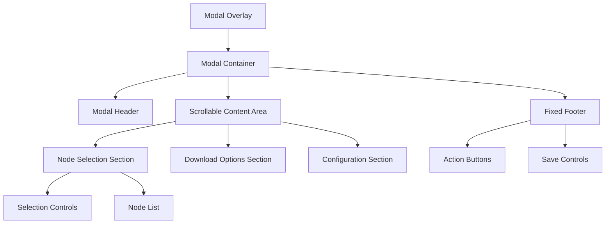

# Design Document

## Overview

This design addresses the template workflow save dialog display issue by implementing a responsive modal system that ensures complete content visibility across all device types. The solution focuses on proper viewport management, scrollable content areas, and responsive breakpoints to provide an optimal user experience when saving workflow templates.

## Architecture

The modal dialog system will be restructured using a layered approach:



The architecture separates concerns between:
- **Modal Overlay**: Handles backdrop and positioning
- **Modal Container**: Manages responsive sizing and viewport constraints
- **Content Areas**: Implements scrolling and section organization
- **Fixed Elements**: Ensures critical controls remain accessible

## Components and Interfaces

### SaveDialogModal Component

```typescript
interface SaveDialogModalProps {
  isOpen: boolean;
  onClose: () => void;
  nodes: WorkflowNode[];
  onSave: (config: SaveConfiguration) => Promise<void>;
  maxHeight?: string;
  responsive?: boolean;
}

interface SaveConfiguration {
  selectedNodes: string[];
  downloadOptions: DownloadOptions;
  workflowName: string;
  saveAsAutomation: boolean;
}
```

### ResponsiveModalContainer Component

```typescript
interface ResponsiveModalContainerProps {
  children: React.ReactNode;
  maxWidth?: ResponsiveBreakpoint;
  maxHeight?: string;
  className?: string;
}

type ResponsiveBreakpoint = {
  mobile: string;
  tablet: string;
  desktop: string;
};
```

### ScrollableContentArea Component

```typescript
interface ScrollableContentAreaProps {
  children: React.ReactNode;
  maxHeight: string;
  showScrollIndicators?: boolean;
  maintainHeaderFooter?: boolean;
}
```

### NodeSelectionPanel Component

```typescript
interface NodeSelectionPanelProps {
  nodes: WorkflowNode[];
  selectedNodes: string[];
  onSelectionChange: (nodeIds: string[]) => void;
  selectionMode: 'all' | 'smart' | 'manual';
  onModeChange: (mode: string) => void;
}
```

## Data Models

### WorkflowNode Model

```typescript
interface WorkflowNode {
  id: string;
  name: string;
  type: string;
  description?: string;
  dependencies: string[];
  isRequired: boolean;
  size: number;
}
```

### DownloadOptions Model

```typescript
interface DownloadOptions {
  includeAssets: boolean;
  compressionLevel: 'none' | 'standard' | 'maximum';
  format: 'json' | 'yaml' | 'xml';
  includeMetadata: boolean;
}
```

### ViewportConstraints Model

```typescript
interface ViewportConstraints {
  maxHeight: string;
  maxWidth: string;
  minHeight: string;
  minWidth: string;
  breakpoints: {
    mobile: number;
    tablet: number;
    desktop: number;
  };
}
```

## Correctness Properties

*A property is a characteristic or behavior that should hold true across all valid executions of a system-essentially, a formal statement about what the system should do. Properties serve as the bridge between human-readable specifications and machine-verifiable correctness guarantees.*

Let me analyze the acceptance criteria for testability:

### Property 1: Viewport Constraint Management
*For any* dialog content size and viewport dimensions, the dialog should fit within viewport bounds, provide scrolling when content exceeds height, and scale appropriately while preventing content truncation.
**Validates: Requirements 1.1, 1.2, 1.5, 4.4**

### Property 2: Critical Button Accessibility
*For any* dialog state and viewport size, the "保存为自动化工作流" button, confirmation controls, and cancel buttons should always be visible and clickable.
**Validates: Requirements 1.4, 5.1, 5.3**

### Property 3: Responsive Device Adaptation
*For any* device type (mobile, tablet, desktop), the dialog should adapt its layout, optimize control sizes for the interaction method, utilize space efficiently, and maintain readable text sizes.
**Validates: Requirements 2.1, 2.2, 2.3, 2.4**

### Property 4: Orientation Change Handling
*For any* screen orientation change, the dialog should adjust its layout to maintain usability and content visibility.
**Validates: Requirements 2.5**

### Property 5: Node Area Content Visibility
*For any* number of nodes and descriptions, the node selection area should display all content without truncation, provide scrolling when needed, and maintain selection control visibility.
**Validates: Requirements 3.1, 3.2, 3.5**

### Property 6: Selection Control Functionality
*For any* dialog state, the "全选", "智能选择", and "清空" buttons should remain functional and provide clear visual feedback for selection changes.
**Validates: Requirements 3.3, 3.4**

### Property 7: Modal Container Positioning
*For any* viewport size, the modal container should center itself appropriately and maintain proper padding and margins for readability.
**Validates: Requirements 4.1, 4.3**

### Property 8: Accessibility Compliance
*For any* user interaction method, the modal should support keyboard navigation and meet accessibility requirements.
**Validates: Requirements 4.5**

### Property 9: Save Process Integrity
*For any* save operation state, the dialog should display all configuration options, provide appropriate feedback, and preserve user selections through completion or error states.
**Validates: Requirements 5.2, 5.4, 5.5**

## Error Handling

### Viewport Constraint Errors
- **Minimum Size Violations**: When viewport is too small to display minimum required content, show a responsive message suggesting landscape orientation or larger screen
- **Content Overflow**: When content cannot fit even with scrolling, implement progressive disclosure to hide non-essential sections
- **Scroll Failure**: If scrolling mechanisms fail, provide alternative navigation methods like pagination

### Responsive Layout Errors
- **Breakpoint Failures**: When CSS breakpoints don't apply correctly, fall back to mobile-first design principles
- **Touch Target Issues**: When touch targets are too small, automatically increase padding and spacing
- **Orientation Change Errors**: If layout doesn't adapt to orientation changes, force a layout recalculation

### Node Selection Errors
- **Large Dataset Handling**: When node lists are extremely large, implement virtualization to maintain performance
- **Selection State Corruption**: If selection state becomes inconsistent, reset to default state with user notification
- **Control Visibility Issues**: When selection controls become hidden, implement floating or sticky positioning

### Save Process Errors
- **Network Failures**: Provide retry mechanisms and offline capability for save operations
- **Validation Errors**: Show inline validation messages without closing the dialog
- **State Persistence Failures**: Implement local storage backup for user selections

## Testing Strategy

### Dual Testing Approach

The testing strategy combines unit tests for specific scenarios with property-based tests for comprehensive coverage:

**Unit Tests Focus:**
- Specific breakpoint transitions (mobile to tablet, tablet to desktop)
- Edge cases like extremely small viewports or very large content
- Error conditions such as network failures during save
- Integration between modal components and parent application

**Property-Based Tests Focus:**
- Universal properties across all viewport sizes and content variations
- Comprehensive input coverage through randomized dialog configurations
- Validation of responsive behavior across continuous ranges of screen sizes
- Correctness properties that hold for all valid dialog states

### Property-Based Testing Configuration

Using **React Testing Library** with **fast-check** for property-based testing:
- Minimum **100 iterations** per property test for thorough randomization
- Each property test references its corresponding design document property
- Tag format: **Feature: template-workflow-save-dialog-fix, Property {number}: {property_text}**

### Test Implementation Requirements

Each correctness property must be implemented by a single property-based test that:
1. Generates random test data (viewport sizes, content amounts, node counts)
2. Renders the dialog component with the generated data
3. Verifies the property holds true across all generated scenarios
4. Provides clear failure messages when properties are violated

The property-based tests will catch edge cases that manual testing might miss, while unit tests will verify specific integration points and error handling scenarios.